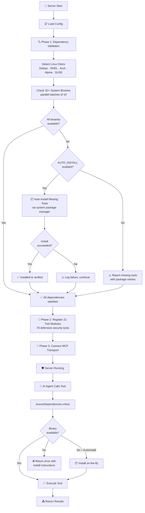
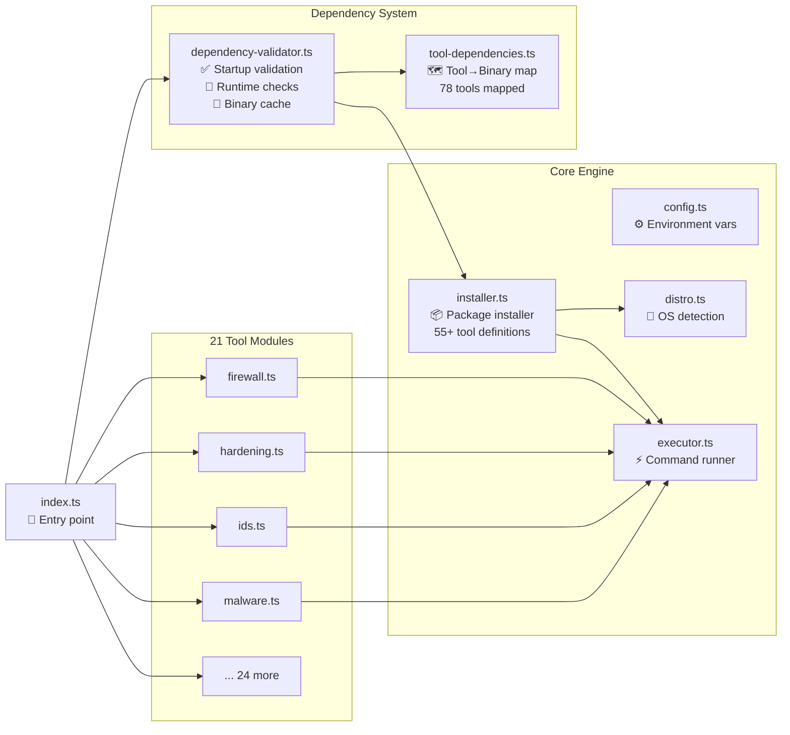
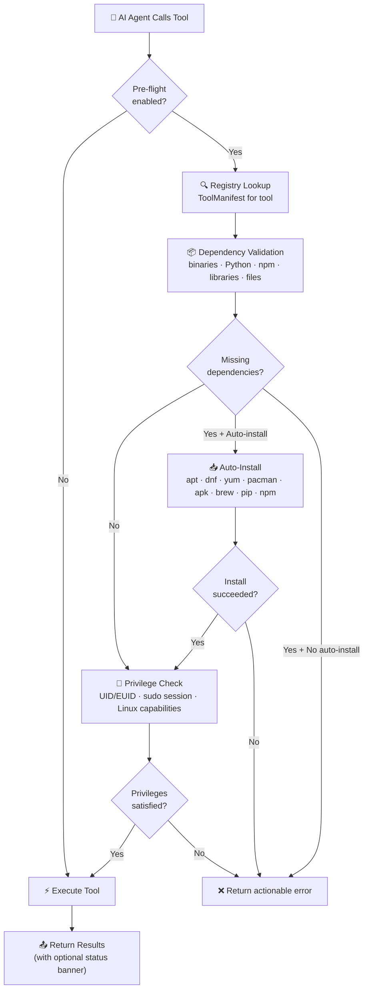
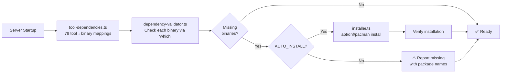

# 🛡️ Kali Defense MCP Server

> **⚠️ DEFENSIVE & HARDENING PURPOSES ONLY**
>
> This tool is designed **exclusively** for defensive security operations, system hardening, compliance auditing, and blue team activities. It is **NOT** intended for offensive security, penetration testing, exploitation, or any unauthorized access to systems. Use responsibly and only on systems you own or have explicit authorization to audit and harden.

A defensive security and system hardening [MCP](https://modelcontextprotocol.io/) (Model Context Protocol) server for Linux. Originally built to leverage the defensive tools available in Kali Linux, it has since grown into a comprehensive security toolkit that works across Debian, Ubuntu, RHEL, Arch, Alpine, and more. Provides **78 defensive security tools** across **21 modules** for blue team operations, system hardening, compliance auditing, incident response, and advanced threat detection.

> **v0.5.0-beta.1**: Major consolidation — 157 fine-grained tools merged into 78 action-based tools. Each tool now accepts an `action` parameter to select sub-operations. All functionality is preserved with reduced MCP registration overhead.

The idea is simple: tell your AI assistant to run a full security audit, and it orchestrates dozens of checks automatically — kernel hardening, firewall policies, CIS benchmarks, open ports, user accounts, secrets scanning, and more. You get back a prioritized report of findings. From there, you can ask it to remediate issues with dry-run previews, automatic backups, and rollback support.

Feedback welcome — open an issue if you find bugs or have suggestions.

> **Tested with** Roo Code (VS Code / VS Codium). Your experience with other MCP clients may vary.

---

## 🚀 Getting Started

### Prerequisites

- **Node.js** 18+ (20 recommended)
- **Linux** (Debian/Ubuntu/Kali, RHEL/CentOS/Fedora, Arch, Alpine, or WSL2)
- **Git** (to clone the repo)

### 1. Clone and Build

```bash
git clone https://github.com/YOUR_USERNAME/kali-defense-mcp-server.git
cd kali-defense-mcp-server
npm install
npm run build
```

### 2. Add to Your MCP Client

Create or edit `.roo/mcp.json` in your project directory (for Roo Code):

```json
{
  "mcpServers": {
    "kali-defense": {
      "command": "node",
      "args": ["/absolute/path/to/kali-defense-mcp-server/build/index.js"],
      "env": {
        "PATH": "/usr/local/sbin:/usr/local/bin:/usr/sbin:/usr/bin:/sbin:/bin",
        "DISPLAY": ":0",
        "WAYLAND_DISPLAY": "wayland-0",
        "XDG_RUNTIME_DIR": "/run/user/1000"
      },
      "alwaysAllow": [
        "sudo_elevate_gui",
        "sudo_status",
        "defense_security_posture",
        "firewall_policy_audit",
        "harden_sysctl_audit",
        "harden_service_audit",
        "harden_kernel_security_audit",
        "access_ssh_audit",
        "access_user_audit",
        "compliance_cis_check",
        "patch_update_audit",
        "calculate_security_score"
      ]
    }
  }
}
```

> **nvm users:** Replace `"command": "node"` with the full path, e.g. `"/home/you/.nvm/versions/node/v20.20.0/bin/node"`.
>
> **Display variables:** The `DISPLAY`, `WAYLAND_DISPLAY`, and `XDG_RUNTIME_DIR` entries are needed for the secure GUI password dialog (`sudo_elevate_gui`). Adjust to match your session.

### 3. Run a Full Audit

In your AI chat, just say:

```
Run a full security audit using the Kali Defense MCP Server.
```

The AI will orchestrate 20+ audit tools, produce a prioritized report, and offer to remediate findings with dry-run previews and automatic backups.

### 4. (Optional) Auto-Install Missing Tools

Many audit tools depend on system packages (`lynis`, `nmap`, `auditd`, etc.). To auto-install them:

```bash
KALI_DEFENSE_AUTO_INSTALL=true npm start
```

Or add to your MCP config:

```json
"env": {
  "KALI_DEFENSE_AUTO_INSTALL": "true"
}
```

---

## 🔐 How Sudo Passwords Are Handled

Many security tools require root privileges. The server provides a **secure two-phase elevation flow** that ensures your sudo password is **never visible to the AI**.

### The Problem

MCP servers run non-interactively via stdio — `sudo` can't prompt for a password through a TTY. The password needs to reach the server process without appearing in the AI conversation.

### The Solution: `sudo_elevate_gui`

A two-phase flow using a native GUI password dialog:

```
┌─────────────────────────────────────────────────────────┐
│  Phase 1: AI calls sudo_elevate_gui                     │
│  → Server returns a zenity command to run                │
│                                                          │
│  Phase 2: AI runs the command via terminal               │
│  → Zenity opens a native password dialog on your screen  │
│  → Password redirected to a temp file (chmod 600)        │
│  → Terminal only shows "READY" — never the password      │
│                                                          │
│  Phase 3: AI calls sudo_elevate_gui again                │
│  → MCP server reads the temp file server-side            │
│  → Validates password with sudo -S -k -v                 │
│  → Stores in zeroable Buffer with auto-expiry            │
│  → Wipes temp file (2x random overwrite + unlink)        │
│  → Returns "🔓 Elevated!" — never the password           │
└─────────────────────────────────────────────────────────┘
```

**What the AI sees at each step:**

| Step | AI Action | AI Sees |
|------|-----------|--------|
| 1 | `sudo_elevate_gui()` | "Run this command..." |
| 2 | `execute_command(zenity ...)` | `READY` |
| 3 | `sudo_elevate_gui()` | `🔓 Elevated!` |

**The password never appears in the chat, terminal output, tool parameters, or AI context.**

### Security Guarantees

| Protection | Implementation |
|------------|----------------|
| Password storage | Zeroable `Buffer` (not V8-interned strings) |
| Auto-expiry | Configurable timeout (default: 15 min, max: 8 hours) |
| Temp file security | `chmod 600`, 2x random byte overwrite before deletion |
| File permission check | Server rejects files not set to `600` |
| Session teardown | `sudo_drop` zeroes buffer + runs `sudo -k` |
| Process exit cleanup | `SIGINT`/`SIGTERM`/`exit` handlers zero the buffer |
| Transparent to tools | All subsequent `sudo` commands receive credentials via stdin pipe automatically |

### Sudo Tools

| Tool | Description |
|------|-------------|
| `sudo_elevate_gui` | Secure GUI-based elevation (recommended) |
| `sudo_elevate` | Elevation with password parameter (fallback for headless systems) |
| `sudo_status` | Check session status and remaining time |
| `sudo_drop` | Drop privileges and zero password buffer |
| `sudo_extend` | Extend session timeout without re-authenticating |
| `preflight_batch_check` | Pre-check multiple tools for sudo/dependency requirements |

---

## How It Works



## Architecture



---

## Features

- **🛡️ Defensive Only** — Built exclusively for blue team operations and system hardening
- **78 Defensive Security Tools** across 21 specialized modules
- **🔒 Security Model** — All commands via `spawn()` with `shell: false`; 17+ input validators blocking shell metacharacters, control characters, and path traversal (`..`)
- **🔍 Automatic Dependency Validation** — Checks all required system binaries at startup
- **📦 Auto-Install Missing Tools** — Installs missing security tools via the system package manager
- **Dry-Run by Default** — All modifying operations preview changes before applying
- **Full Audit Trail** — Every change logged with UUID, timestamps, before/after state, and rollback commands
- **Auto-Backup** — Files automatically backed up to `~/.kali-mcp-backups/` before modification
- **Rollback Support** — Per-operation and per-session rollback for file, sysctl, service, and firewall changes
- **🔑 Sudo Session Management** — Zeroable buffer password storage, auto-expiry, session extend
- **Application Safeguards** — Detects VS Code, Docker, MCP servers, databases, and web servers before executing changes
- **🐧 Cross-Distribution** — Debian/Ubuntu/Kali, RHEL/CentOS/Fedora, Arch/Manjaro, Alpine, openSUSE/SLES
- **WSL2 Compatible** — Most read-only audit tools work in WSL2; modifying tools require Linux kernel
- **Policy Engine** — Custom compliance policies with declarative rule definitions
- **CIS Benchmark** — Built-in CIS benchmark checks for Linux systems
- **Multi-Framework Compliance** — PCI-DSS v4, HIPAA, SOC 2, ISO 27001, GDPR checks
- **🔎 Pre-flight Validation** — Automatic dependency, privilege, and capability checks before every tool invocation

---

## Pre-flight Validation System

Every tool invocation is automatically preceded by a comprehensive pre-flight check that validates dependencies, detects privilege requirements, and optionally auto-installs missing packages — all transparently, without any changes needed in tool handlers.

### How It Works



The pre-flight pipeline runs in 7 steps:

1. **Interception** — Tool invocation intercepted by the `Proxy`-based middleware wrapping `McpServer`
2. **Registry lookup** — Resolves the tool's `ToolManifest` from the registry (binaries, Python modules, npm packages, libraries, files, sudo requirements, Linux capabilities)
3. **Dependency validation** — Checks all declared dependencies with cached binary lookups
4. **Auto-installation** — If enabled and dependencies are missing, resolves them via the appropriate package manager (supports apt, dnf, yum, pacman, apk, brew, pip, npm)
5. **Privilege check** — Validates against current UID/EUID, active sudo session, passwordless sudo, and Linux capabilities (parsed from `/proc/self/status` CapEff bitmask)
6. **Pass/fail decision** — Generates a structured result with human-readable status messages
7. **Execution or error** — If passed: tool handler executes normally; if failed: actionable error returned without executing the handler

Results are cached for 60 seconds to avoid redundant checks on sequential tool calls.

### Configuration

| Variable | Default | Description |
|----------|---------|-------------|
| `KALI_DEFENSE_AUTO_INSTALL` | `false` | Enable automatic dependency installation when pre-flight detects missing packages |
| `KALI_DEFENSE_PREFLIGHT` | `true` | Enable/disable pre-flight checks entirely (set to `false` to bypass all checks) |
| `KALI_DEFENSE_PREFLIGHT_BANNERS` | `true` | Show pre-flight status banners in tool output when there are warnings or auto-installed deps |

### Adding Pre-flight to New Tools

New tools automatically get pre-flight validation with just two steps:

1. **Add binary requirements** — Add an entry to `TOOL_DEPENDENCIES` in [`tool-dependencies.ts`](src/core/tool-dependencies.ts) mapping the tool name to its required binaries
2. **Add privilege metadata** — Add a `ToolManifest` overlay to `SUDO_OVERLAYS` in [`tool-registry.ts`](src/core/tool-registry.ts) declaring the tool's sudo level (`"never"`, `"always"`, or `"conditional"`), capabilities, and reason

That's it — the middleware wrapper handles the rest. No changes to the tool handler are needed.

### Pre-flight Output Examples

**✅ Passing — all checks satisfied:**

```
✅ Pre-flight passed for 'firewall_iptables_list'
  Dependencies: 2/2 available (iptables, ip6tables)
  Privileges: sudo session active
  Ready to execute.
```

**✅ Passing with auto-install:**

```
✅ Pre-flight passed for 'compliance_lynis_audit' (auto-installed 1 dependency)
  Dependencies: 1/1 available (lynis — Installed 'lynis' via apt (lynis))
  Privileges: sudo session active
  Ready to execute.
```

**❌ Failing — missing dependency and privilege issues:**

```
❌ Pre-flight FAILED for 'compliance_oscap_scan'
  Missing dependencies:
    • oscap (binary) — Install with: sudo apt-get install -y libopenscap8
  Privilege issues:
    • Tool 'compliance_oscap_scan' requires elevated privileges to root access required for OpenSCAP scanning. No active sudo session or passwordless sudo detected.
    → Call the 'sudo_elevate' tool first to provide your credentials for this session.
  Cannot proceed until issues are resolved.
```

---

## Quick Start

```bash
cd kali-defense-mcp-server
npm install
npm run build
npm start
```

Development mode with hot reload:

```bash
npm run dev
```

### Enable Auto-Install of Missing Tools

```bash
KALI_DEFENSE_AUTO_INSTALL=true npm start
```

On startup, the server will:
1. Detect your Linux distribution and package manager
2. Check all 32+ required system binaries
3. Automatically install any missing tools
4. Report a detailed validation summary

```
╔══════════════════════════════════════════════════════════╗
║       Kali Defense MCP — Dependency Validation          ║
╚══════════════════════════════════════════════════════════╝

  Binaries checked:    32
  Available:           32
  Auto-installed:      21
    ✅ iptables
    ✅ lynis
    ✅ nmap
    ...

  Auto-install: ENABLED
  Duration: 45s
```

---

## ⚠️ Defensive Use Only — Disclaimer

This MCP server is a **defensive security toolkit** designed for:

| ✅ Intended Use | ❌ NOT Intended For |
|----------------|---------------------|
| System hardening & CIS benchmarks | Penetration testing |
| Compliance auditing (PCI-DSS, HIPAA, SOC2) | Exploitation or vulnerability exploitation |
| Intrusion detection & rootkit scanning | Unauthorized access to systems |
| Firewall configuration & policy enforcement | Network attacks or reconnaissance against others |
| Incident response & forensic collection | Any illegal or unauthorized activity |
| Blue team operations & threat hunting | Offensive security operations |
| Security posture assessment & scoring | |
| Malware scanning & quarantine | |

**You are solely responsible for ensuring you have proper authorization before running any security tools on any system.**

---

## OS Compatibility Matrix

| Feature | Kali Linux | Ubuntu/Debian | RHEL/CentOS/Fedora | Arch Linux | Alpine Linux | WSL2 | macOS |
|---------|-----------|---------------|---------------------|-----------|--------------|------|-------|
| Firewall (iptables/ufw) | Full | Full | Full (firewalld) | Full | Full | Partial | No |
| System Hardening | Full | Full | Full | Full | Partial | Partial | No |
| Intrusion Detection | Full | Full | Full | Full | Partial | Partial | No |
| Log Analysis (auditd) | Full | Full | Full | Full | Partial | No | No |
| Network Defense | Full | Full | Full | Full | Full | Partial | Partial |
| Compliance/Lynis | Full | Full | Full | Full | Partial | Partial | No |
| Malware/ClamAV | Full | Full | Full | Full | Full | Full | Partial |
| Backup & Recovery | Full | Full | Full | Full | Full | Full | Partial |
| Access Control | Full | Full | Full | Full | Partial | Full | Partial |
| Encryption & PKI | Full | Full | Full | Full | Full | Full | Full |
| Container Security | Full | Full | Full | Full | Partial | Partial | Partial |
| Patch Management | Apt/Dpkg | Apt/Dpkg | Dnf/Rpm | Pacman | Apk | Apt/Dpkg | No |
| eBPF Security | Full | Full | Full | Full | No | No | No |
| Memory Protection | Full | Full | Full | Full | Partial | Partial | No |
| Zero-Trust Network | Full | Full | Full | Full | Partial | Partial | No |
| CVE Lookup | Full | Full | Full | Full | Full | Full | Full |
| Drift Detection | Full | Full | Full | Full | Full | Full | Partial |

**Notes**:
- WSL2 does not have a real Linux kernel init (systemd limited), which affects service management, auditd, and some sysctl settings
- macOS support is limited to tools that run OpenSSL, curl, or Python — no kernel-level operations
- "Partial" indicates most functionality works with some commands unavailable

---

## Tool Categories (78 tools across 21 modules)

Each tool uses an `action` parameter to select sub-operations. For example, `harden_sysctl` supports `action: "get" | "set" | "audit"`.

| Module | Tool Count | Tools |
|--------|:---------:|-------|
| Firewall (`firewall.ts`) | 5 | `firewall_iptables`, `firewall_ufw`, `firewall_persist`, `firewall_nftables_list`, `firewall_policy_audit` |
| Hardening (`hardening.ts`) | 8 | `harden_sysctl`, `harden_service`, `harden_permissions`, `harden_systemd`, `harden_kernel`, `harden_bootloader`, `harden_misc`, `memory_protection` |
| IDS (`ids.ts`) | 3 | `ids_aide_manage`, `ids_rootkit_scan`, `ids_file_integrity_check` |
| Logging (`logging.ts`) | 4 | `log_auditd`, `log_journalctl_query`, `log_fail2ban`, `log_system` |
| Network Defense (`network-defense.ts`) | 3 | `netdef_connections`, `netdef_capture`, `netdef_security_audit` |
| Compliance (`compliance.ts`) | 7 | `compliance_lynis_audit`, `compliance_oscap_scan`, `compliance_check`, `compliance_policy_evaluate`, `compliance_report`, `compliance_cron_restrict`, `compliance_tmp_hardening` |
| Malware (`malware.ts`) | 4 | `malware_clamav`, `malware_yara_scan`, `malware_file_scan`, `malware_quarantine_manage` |
| Backup (`backup.ts`) | 1 | `backup` |
| Access Control (`access-control.ts`) | 6 | `access_ssh`, `access_sudo_audit`, `access_user_audit`, `access_password_policy`, `access_pam`, `access_restrict_shell` |
| Encryption (`encryption.ts`) | 4 | `crypto_tls`, `crypto_gpg_keys`, `crypto_luks_manage`, `crypto_file_hash` |
| Container Security (`container-security.ts`) | 6 | `container_docker`, `container_apparmor`, `container_selinux_manage`, `container_namespace_check`, `container_image_scan`, `container_security_config` |
| Patch Management (`patch-management.ts`) | 5 | `patch_update_audit`, `patch_unattended_audit`, `patch_integrity_check`, `patch_kernel_audit`, `vulnerability_intel` |
| Secrets (`secrets.ts`) | 4 | `secrets_scan`, `secrets_env_audit`, `secrets_ssh_key_sprawl`, `scan_git_history` |
| Incident Response (`incident-response.ts`) | 1 | `incident_response` |
| Meta (`meta.ts`) | 5 | `defense_check_tools`, `defense_workflow`, `defense_change_history`, `security_posture`, `scheduled_audit` |
| Sudo Management (`sudo-management.ts`) | 6 | `sudo_elevate`, `sudo_elevate_gui`, `sudo_status`, `sudo_drop`, `sudo_extend`, `preflight_batch_check` |
| Supply Chain (`supply-chain-security.ts`) | 1 | `supply_chain` |
| Drift Detection (`drift-detection.ts`) | 1 | `drift_baseline` |
| Zero-Trust (`zero-trust-network.ts`) | 1 | `zero_trust` |
| eBPF Security (`ebpf-security.ts`) | 2 | `list_ebpf_programs`, `falco` |
| App Hardening (`app-hardening.ts`) | 1 | `app_harden` |
| **Total** | **78** | |

### Sudo Management (6 tools)

| Tool | Description |
|------|-------------|
| `sudo_elevate_gui` | Secure GUI-based elevation — password never visible to the AI (recommended) |
| `sudo_elevate` | Elevate privileges by caching sudo credentials securely (fallback for headless) |
| `sudo_status` | Check current sudo session status and remaining time |
| `sudo_drop` | Drop elevated privileges and zero the password buffer |
| `sudo_extend` | Extend an active sudo session timeout (default: 15 min, max: 480 min) |
| `preflight_batch_check` | Pre-check multiple tools for sudo/dependency requirements before execution |

---

## Dependency Auto-Installation

The server includes a built-in dependency validation system that ensures all required security tools are installed.

### How It Works



### Configuration

| Variable | Default | Description |
|----------|---------|-------------|
| `KALI_DEFENSE_AUTO_INSTALL` | `false` | Set to `true` to auto-install missing tools at startup |
| `KALI_DEFENSE_DRY_RUN` | `false` | Set to `true` to preview all operations without executing |

### What Gets Installed

The system maps **every MCP tool** to its required system binaries. For example:

| MCP Tool | Required Binary | Package (Debian) |
|----------|----------------|------------------|
| `ids_rkhunter_scan` | `rkhunter` | `rkhunter` |
| `malware_clamav_scan` | `clamscan` | `clamav` |
| `compliance_lynis_audit` | `lynis` | `lynis` |
| `harden_sysctl_audit` | `sysctl` | `procps` |
| `log_auditd_rules` | `auditctl` | `auditd` |
| `netdef_self_scan` | `nmap` | `nmap` |
| `crypto_tls_audit` | `openssl` | `openssl` |
| `firewall_iptables_list` | `iptables` | `iptables` |

---

## Application Safeguards

The server includes a `SafeguardRegistry` that detects running applications and warns operators before potentially disruptive operations proceed.

### What Is Detected

| Application | Detection Method |
|-------------|-----------------|
| VS Code | Process check (`pgrep -f code`), `~/.vscode` directory, IPC sockets in `/run/user/<uid>/` |
| Docker | `/var/run/docker.sock` socket, `docker ps` container list |
| MCP Servers | `.mcp.json` configuration file, node processes with `mcp` in command line |
| Databases | TCP port probing: PostgreSQL (5432), MySQL (3306), MongoDB (27017), Redis (6379) |
| Web Servers | Process check for `nginx`, `apache2`, `httpd` |

### Dry-Run Mode

The server defaults to dry-run mode when `KALI_DEFENSE_DRY_RUN=true`. In this mode, modifying tools print the exact command that would run without executing it:

```
[DRY-RUN] Would execute:
  sudo iptables -t filter -I INPUT -p tcp --dport 443 -j ACCEPT

Rollback command:
  sudo iptables -t filter -D INPUT -p tcp --dport 443 -j ACCEPT
```

See [SAFEGUARDS.md](SAFEGUARDS.md) for complete documentation.

---

## Configuration

All configuration is via environment variables:

| Variable | Default | Description |
|----------|---------|-------------|
| `KALI_DEFENSE_DRY_RUN` | `false` | Dry-run mode (true = preview only, no changes) |
| `KALI_DEFENSE_AUTO_INSTALL` | `false` | Auto-install missing tools at startup |
| `KALI_DEFENSE_TIMEOUT_DEFAULT` | `120` | Default command timeout (seconds) |
| `KALI_DEFENSE_SUDO_TIMEOUT` | `15` | Sudo session timeout (minutes) |
| `KALI_DEFENSE_MAX_OUTPUT_SIZE` | `10485760` | Max output buffer (bytes, 10 MB) |
| `KALI_DEFENSE_ALLOWED_DIRS` | `/tmp,/home,/var/log,/etc` | Allowed file operation directories |
| `KALI_DEFENSE_CHANGELOG_PATH` | `~/.kali-defense/changelog.json` | Audit log location |
| `KALI_DEFENSE_BACKUP_DIR` | `~/.kali-defense/backups` | Auto-backup storage directory |
| `KALI_DEFENSE_QUARANTINE_DIR` | `~/.kali-defense/quarantine` | Malware quarantine directory |
| `KALI_DEFENSE_POLICY_DIR` | `~/.kali-defense/policies` | Custom policy directory |
| `KALI_DEFENSE_PROTECTED_PATHS` | `/boot,/usr/lib/systemd,...` | Paths protected from modification |
| `KALI_DEFENSE_REQUIRE_CONFIRMATION` | `true` | Require confirmation for changes |
| `KALI_DEFENSE_LOG_LEVEL` | `info` | Log verbosity (debug/info/warn/error) |

Per-tool timeout overrides: `KALI_DEFENSE_TIMEOUT_<TOOLNAME>` (value in seconds). Supported tools: `lynis`, `aide`, `clamav`, `oscap`, `snort`, `suricata`, `rkhunter`, `chkrootkit`, `tcpdump`, `auditd`, `nmap`, `fail2ban-client`, `debsums`, `yara`.

## MCP Configuration

Add to `.mcp.json` or MCP settings:

```json
{
  "mcpServers": {
    "kali-defense": {
      "command": "node",
      "args": ["/path/to/kali-defense-mcp-server/build/index.js"],
      "env": {
        "KALI_DEFENSE_DRY_RUN": "true",
        "KALI_DEFENSE_AUTO_INSTALL": "true"
      }
    }
  }
}
```

For live changes (disable dry-run):

```json
{
  "mcpServers": {
    "kali-defense": {
      "command": "node",
      "args": ["/path/to/kali-defense-mcp-server/build/index.js"],
      "env": {
        "KALI_DEFENSE_DRY_RUN": "false",
        "KALI_DEFENSE_AUTO_INSTALL": "true"
      }
    }
  }
}
```

---

## Security Model

- **shell: false** — All commands executed via `spawn()` with no shell interpretation
- **Path Traversal Protection** — `..` segments blocked in all file path inputs (new in v0.3.0)
- **Input Sanitization** — 17+ validators block shell metacharacters, path traversal, control characters
- **Dry-Run Default** — All modifying operations support preview mode
- **Audit Trail** — Every change logged with UUID, timestamp, before/after state, rollback command
- **Auto-Backup** — Files backed up to `~/.kali-mcp-backups/` before modification, tracked in `manifest.json`
- **Rollback Support** — RollbackManager tracks file, sysctl, service, and firewall changes for per-operation or per-session rollback
- **Sudo Session Security** — Password stored in zeroable Buffer, never logged, auto-expires after configurable timeout
- **Application Safeguards** — SafeguardRegistry detects Docker, MCP servers, databases, and web servers; emits pre-execution warnings
- **Protected Paths** — Configurable list of paths that cannot be modified
- **Buffer Capping** — Output capped at configurable max size (default 10 MB)
- **Timeout Enforcement** — All commands have configurable timeouts (default 120s)

---

## Documentation

| Document | Purpose |
|----------|---------|
| [SAFEGUARDS.md](SAFEGUARDS.md) | SafeguardRegistry detection, dry-run usage, backup storage, rollback guide |
| [TOOLS-REFERENCE.md](TOOLS-REFERENCE.md) | Alphabetical table of all 78 tools with parameters, dryRun support, OS compatibility |
| [STANDARDS.md](STANDARDS.md) | CIS, NIST SP 800-53, PCI-DSS, HIPAA, SOC 2, ISO 27001, GDPR control mapping |
| [ARCHITECTURE.md](ARCHITECTURE.md) | Technical architecture and module structure |
| [CHANGELOG.md](CHANGELOG.md) | Version history |

---

## Changelog

### v0.5.0-beta.1 (2026-03-06)

Major security remediation release — see [CHANGELOG.md](CHANGELOG.md) for full details.

**Highlights:**
- 🔒 Security hardening: password buffer pipeline, command allowlist, auto-install hardening, secure file permissions
- 🧪 221 tests across 6 test modules with 0 failures
- 🔧 Tool consolidation: 157 → 78 action-based tools across 21 modules
- 📄 Complete documentation synchronization

---

## License

MIT

---

> **Remember:** This tool is for **defensive security and system hardening only**. Always ensure you have proper authorization before auditing or modifying any system. Use responsibly.
