# Tool Consolidation Plan — Defense MCP Server

**Status:** Design document — no source files modified  
**Author:** Architect analysis of all 32 tool source files  
**Date:** 2026-03-12  
**Scope:** 94 tools across 32 source files → ~31 tools across ~29 source files

---

## Table of Contents

1. [Current Tool Inventory](#1-current-tool-inventory)
2. [Proposed Consolidation Map](#2-proposed-consolidation-map)
3. [Tools That Stay Solo](#3-tools-that-stay-solo)
4. [Migration Table](#4-migration-table)
5. [File Consolidation Map](#5-file-consolidation-map)
6. [Impact Assessment](#6-impact-assessment)
7. [Implementation Order](#7-implementation-order)

---

## 1. Current Tool Inventory

> **Actual count from source inspection: 94 tools.** The README/index.ts references "~94" tools; the task prompt stated 78 (an earlier count). This plan uses the authoritative source-code count of 94.

### `access-control.ts` — 6 tools

| Tool Name | Actions | Description |
|---|---|---|
| `access_ssh` | `audit`, `harden`, `cipher_audit` | SSH server security: config audit, hardening, cipher audit |
| `access_pam` | `audit`, `configure` | PAM configuration: audit and configure pwquality/faillock |
| `access_sudo_audit` | _(no action param)_ | Audit sudoers configuration for security weaknesses |
| `access_user_audit` | _(check_type param)_ | Audit user accounts: privileged, inactive, no-password, shells |
| `access_password_policy` | `audit`, `set` | Audit or set /etc/login.defs password policy |
| `access_restrict_shell` | _(username/shell params)_ | Restrict a user's login shell to nologin |

### `api-security.ts` — 1 tool

| Tool Name | Actions | Description |
|---|---|---|
| `api_security` | `scan_local_apis`, `audit_auth`, `check_rate_limiting`, `tls_verify`, `cors_check` | API security: discover APIs, audit auth, rate limiting, TLS, CORS |

### `app-hardening.ts` — 1 tool

| Tool Name | Actions | Description |
|---|---|---|
| `app_harden` | `audit`, `recommend`, `firewall`, `systemd` | Application hardening: detect apps, guide, firewall rules, systemd sandboxing |

### `backup.ts` — 1 tool

| Tool Name | Actions | Description |
|---|---|---|
| `backup` | `config`, `state`, `restore`, `verify`, `list` | Backup management: config files, system state, restore, integrity verify |

### `cloud-security.ts` — 1 tool

| Tool Name | Actions | Description |
|---|---|---|
| `cloud_security` | `detect_environment`, `audit_metadata`, `check_iam_creds`, `audit_storage`, `check_imds` | Cloud security: detect provider, audit IMDS, check IAM credentials, storage, IMDS security |

### `compliance.ts` — 7 tools

| Tool Name | Actions | Description |
|---|---|---|
| `compliance_lynis_audit` | _(profile/test_group params)_ | Run Lynis comprehensive security audit |
| `compliance_oscap_scan` | _(profile/content params)_ | Run OpenSCAP XCCDF compliance scan |
| `compliance_check` | `cis`, `framework` | CIS benchmark checks or framework checks (PCI-DSS, HIPAA, SOC2, etc.) |
| `compliance_policy_evaluate` | _(policy_name/policy_path params)_ | Evaluate built-in or custom compliance policy |
| `compliance_report` | _(format/include_* params)_ | Generate consolidated compliance summary report |
| `compliance_cron_restrict` | `create_allow_files`, `status` | Create/manage /etc/cron.allow and /etc/at.allow (CIS 5.1.8, 5.1.9) |
| `compliance_tmp_hardening` | `audit`, `apply` | Audit/apply /tmp mount hardening with nodev,nosuid,noexec (CIS 1.1.4) |

### `container-security.ts` — 6 tools

| Tool Name | Actions | Description |
|---|---|---|
| `container_docker` | `audit`, `bench`, `seccomp`, `daemon` | Docker: security audit, CIS benchmark, seccomp profiles, daemon config |
| `container_apparmor` | `status`, `list`, `enforce`, `complain`, `disable`, `install`, `apply_container` | AppArmor: status, list profiles, enforce/complain/disable, install, generate container profiles |
| `container_security_config` | `seccomp_profile`, `rootless` | Container security config: generate seccomp profiles, rootless setup |
| `container_selinux_manage` | `status`, `getenforce`, `setenforce`, `booleans`, `audit` | SELinux: status, get/set enforcement, booleans, AVC denials |
| `container_namespace_check` | _(check_type/pid params)_ | Linux namespace isolation check for processes |
| `container_image_scan` | _(image/severity params)_ | Scan Docker images with Trivy or Grype |

### `deception.ts` — 1 tool

| Tool Name | Actions | Description |
|---|---|---|
| `honeypot_manage` | `deploy_canary`, `deploy_honeyport`, `check_triggers`, `remove`, `list` | Honeypot/deception: canary tokens, honeyport listeners, trigger detection |

### `dns-security.ts` — 1 tool

| Tool Name | Actions | Description |
|---|---|---|
| `dns_security` | `audit_resolv`, `check_dnssec`, `detect_tunneling`, `block_domains`, `query_log_audit` | DNS security: resolver audit, DNSSEC check, tunneling detection, blocking, log audit |

### `drift-detection.ts` — 1 tool

| Tool Name | Actions | Description |
|---|---|---|
| `drift_baseline` | `create`, `compare`, `list` | Drift detection: create system baselines, compare state, list baselines |

### `ebpf-security.ts` — 2 tools

| Tool Name | Actions | Description |
|---|---|---|
| `ebpf_list_programs` | _(dryRun param)_ | List loaded eBPF programs and pinned maps |
| `ebpf_falco` | `status`, `deploy_rules`, `events` | Falco runtime security: status, deploy rules, read events |

### `encryption.ts` — 5 tools

| Tool Name | Actions | Description |
|---|---|---|
| `crypto_tls` | `remote_audit`, `cert_expiry`, `config_audit` | TLS/SSL: audit remote host, check cert expiry, audit local web server TLS |
| `crypto_gpg_keys` | `list`, `generate`, `export`, `import`, `verify` | GPG key management |
| `crypto_luks_manage` | `status`, `dump`, `open`, `close`, `list` | LUKS encrypted volume management |
| `crypto_file_hash` | _(path/algorithm params)_ | Calculate cryptographic hashes for integrity verification |
| `certificate_lifecycle` | `inventory`, `auto_renew_check`, `ca_audit`, `ocsp_check`, `ct_log_monitor` | Certificate lifecycle: inventory, auto-renewal, CA trust store, OCSP, CT logs |

### `firewall.ts` — 5 tools

| Tool Name | Actions | Description |
|---|---|---|
| `firewall_iptables` | `list`, `add`, `delete`, `set_policy`, `create_chain` | Manage iptables rules and chains |
| `firewall_ufw` | `status`, `add`, `delete` | Manage UFW firewall |
| `firewall_persist` | `save`, `restore`, `enable`, `status` | Firewall rule persistence |
| `firewall_nftables_list` | _(table/family params)_ | List nftables ruleset |
| `firewall_policy_audit` | _(no params)_ | Audit firewall configuration for security issues |

### `hardening.ts` — 9 tools

| Tool Name | Actions | Description |
|---|---|---|
| `harden_sysctl` | `get`, `set`, `audit` | Manage sysctl kernel parameters |
| `harden_service` | `manage`, `audit` | Manage/audit systemd services |
| `harden_permissions` | `check`, `fix`, `audit` | Manage file permissions |
| `harden_systemd` | `audit`, `apply` | Systemd service security hardening |
| `harden_kernel` | `audit`, `modules`, `coredump` | Kernel security: CPU vulns/LSM/lockdown, module blacklisting, core dumps |
| `harden_bootloader` | `audit`, `configure` | Bootloader security: GRUB audit, kernel params |
| `harden_misc` | `cron_audit`, `umask_audit`, `umask_set`, `banner_audit`, `banner_set` | Miscellaneous hardening: cron, umask, login banners |
| `harden_memory` | `audit`, `enforce_aslr`, `report` | Memory protections: binary mitigations, ASLR, exploit mitigation report |
| `usb_device_control` | `audit_devices`, `block_storage`, `whitelist`, `monitor` | USB device security control |

### `ids.ts` — 3 tools

| Tool Name | Actions | Description |
|---|---|---|
| `ids_aide_manage` | `init`, `check`, `update`, `compare` | AIDE file integrity database management |
| `ids_rootkit_scan` | `rkhunter`, `chkrootkit`, `all` | Rootkit detection: rkhunter, chkrootkit, combined scan |
| `ids_file_integrity_check` | _(paths/baseline_path params)_ | Quick file integrity check using SHA-256 hashes |

### `incident-response.ts` — 2 tools

| Tool Name | Actions | Description |
|---|---|---|
| `incident_response` | `collect`, `ioc_scan`, `timeline` | Incident response: volatile data collection, IOC scan, filesystem timeline |
| `ir_forensics` | `memory_dump`, `disk_image`, `network_capture_forensic`, `evidence_bag`, `chain_of_custody` | Digital forensics: memory dump, disk image, network capture, evidence bagging, chain-of-custody |

### `logging.ts` — 4 tools

| Tool Name | Actions | Description |
|---|---|---|
| `log_auditd` | `rules`, `search`, `report`, `cis_rules` | Auditd: manage rules, search logs, reports, CIS rules |
| `log_journalctl_query` | _(filter params)_ | Query systemd journal |
| `log_fail2ban` | `status`, `ban`, `unban`, `reload`, `audit` | Fail2ban: status, ban/unban IPs, reload, audit jails |
| `log_system` | `analyze`, `rotation_audit` | System log analysis and log rotation audit |

### `malware.ts` — 4 tools

| Tool Name | Actions | Description |
|---|---|---|
| `malware_clamav` | `scan`, `update` | ClamAV: scan files, update definitions |
| `malware_yara_scan` | _(rules_path/target_path params)_ | YARA rule-based malware scanning |
| `malware_file_scan` | `suspicious`, `webshell` | File scanning: suspicious files (SUID/world-writable/etc.), webshell detection |
| `malware_quarantine_manage` | `list`, `restore`, `delete`, `info` | Manage quarantined files |

### `meta.ts` — 6 tools

| Tool Name | Actions | Description |
|---|---|---|
| `defense_check_tools` | _(category/install_missing params)_ | Check availability of defensive security tools |
| `defense_workflow` | `suggest`, `run` | Defense workflows: suggest workflow, execute predefined workflow |
| `defense_change_history` | _(limit/tool/since params)_ | View audit trail of all defensive changes |
| `defense_security_posture` | `score`, `trend`, `dashboard` | Security posture: score, trend history, dashboard |
| `defense_scheduled_audit` | `create`, `list`, `remove`, `history` | Scheduled security audits |
| `auto_remediate` | `plan`, `apply`, `rollback_session`, `status` | Automated remediation: plan, apply, rollback, status |

### `network-defense.ts` — 4 tools

| Tool Name | Actions | Description |
|---|---|---|
| `netdef_connections` | `list`, `audit` | Network connections: list active, audit listening ports |
| `netdef_capture` | `custom`, `dns`, `arp` | Network capture: tcpdump, DNS monitoring, ARP monitoring |
| `netdef_security_audit` | `scan_detect`, `ipv6`, `self_scan` | Network security: port scan detection, IPv6 audit, nmap self-scan |
| `network_segmentation_audit` | `map_zones`, `verify_isolation`, `test_paths`, `audit_vlans` | Network segmentation: zone mapping, isolation verification, path testing, VLAN audit |

### `patch-management.ts` — 5 tools

| Tool Name | Actions | Description |
|---|---|---|
| `patch_update_audit` | _(security_only param)_ | Audit pending security updates |
| `patch_unattended_audit` | _(no params)_ | Audit unattended-upgrades configuration |
| `patch_integrity_check` | _(package_name/changed_only params)_ | Verify installed package integrity via debsums/rpm -V |
| `patch_kernel_audit` | _(no params)_ | Audit kernel version, livepatch status, CPU vulnerabilities |
| `patch_vulnerability_intel` | `lookup`, `scan`, `urgency` | Vulnerability intelligence: CVE lookup, package CVE scan, patch urgency |

### `process-security.ts` — 1 tool

| Tool Name | Actions | Description |
|---|---|---|
| `process_security` | `audit_running`, `check_capabilities`, `check_namespaces`, `detect_anomalies`, `cgroup_audit` | Process security: audit processes, capabilities, namespaces, anomalies, cgroups |

### `reporting.ts` — 1 tool

| Tool Name | Actions | Description |
|---|---|---|
| `report_export` | `generate`, `list_reports`, `formats` | Generate, list, or query security reports in multiple formats |

### `secrets.ts` — 4 tools

| Tool Name | Actions | Description |
|---|---|---|
| `secrets_scan` | _(path/scan_type params)_ | Scan filesystem for hardcoded secrets |
| `secrets_env_audit` | _(check_env/check_files params)_ | Audit environment variable security and .env file exposure |
| `secrets_ssh_key_sprawl` | _(search_path/check_authorized_keys params)_ | Detect SSH key sprawl, check permissions and age |
| `secrets_git_history_scan` | _(repoPath/dryRun params)_ | Scan git history for leaked secrets (truffleHog/gitleaks) |

### `siem-integration.ts` — 1 tool

| Tool Name | Actions | Description |
|---|---|---|
| `siem_export` | `configure_syslog_forward`, `configure_filebeat`, `audit_forwarding`, `test_connectivity` | SIEM integration: rsyslog forwarding, Filebeat config, forwarding audit, connectivity test |

### `sudo-management.ts` — 6 tools

| Tool Name | Actions | Description |
|---|---|---|
| `sudo_elevate` | _(password/timeout_minutes params)_ | Elevate privileges with password caching |
| `sudo_elevate_gui` | _(timeout_minutes param)_ | Elevate privileges via GUI password dialog |
| `sudo_status` | _(no params)_ | Check current sudo elevation status |
| `sudo_drop` | _(no params)_ | Drop elevated privileges immediately |
| `sudo_extend` | _(minutes param)_ | Extend current sudo session timeout |
| `preflight_batch_check` | _(tools param)_ | Pre-check multiple tools before executing |

### `supply-chain-security.ts` — 1 tool

| Tool Name | Actions | Description |
|---|---|---|
| `supply_chain` | `sbom`, `sign`, `verify_slsa` | Supply chain security: SBOM generation, cosign signing, SLSA verification |

### `threat-intel.ts` — 1 tool

| Tool Name | Actions | Description |
|---|---|---|
| `threat_intel` | `check_ip`, `check_hash`, `check_domain`, `update_feeds`, `blocklist_apply` | Threat intelligence: IP/hash/domain reputation, feed management, blocklist application |

### `vulnerability-management.ts` — 1 tool

| Tool Name | Actions | Description |
|---|---|---|
| `vuln_manage` | `scan_system`, `scan_web`, `track`, `prioritize`, `remediation_plan` | Vulnerability management: nmap/nikto scan, track vulns, prioritize, generate remediation plan |

### `waf.ts` — 1 tool

| Tool Name | Actions | Description |
|---|---|---|
| `waf_manage` | `modsec_audit`, `modsec_rules`, `rate_limit_config`, `owasp_crs_deploy`, `blocked_requests` | WAF management: ModSecurity audit/rules, rate limiting, OWASP CRS, blocked request analysis |

### `wireless-security.ts` — 1 tool

| Tool Name | Actions | Description |
|---|---|---|
| `wireless_security` | `bt_audit`, `wifi_audit`, `rogue_ap_detect`, `disable_unused` | Wireless security: Bluetooth audit, WiFi assessment, rogue AP detection, disable unused |

### `zero-trust-network.ts` — 1 tool

| Tool Name | Actions | Description |
|---|---|---|
| `zero_trust` | `wireguard`, `wg_peers`, `mtls`, `microsegment` | Zero-trust: WireGuard VPN setup, peer management, mTLS certs, microsegmentation |

---

## 2. Proposed Consolidation Map

### Design Principles

1. **Action namespacing on merge**: When multiple tools with overlapping action names (e.g., two tools both with `action: "audit"`) are merged, actions are prefixed with the sub-domain name (e.g., `sysctl_audit`, `kernel_audit`) to prevent ambiguity.
2. **Source file reuse**: Merged tools stay in the larger/primary source file; smaller files are deleted.
3. **No capability loss**: Every existing action, parameter, and behavior is preserved.

---

### MERGE-01: `firewall` — All Firewall Tools

**New tool name:** `firewall`  
**Absorbs:** `firewall_iptables`, `firewall_ufw`, `firewall_persist`, `firewall_nftables_list`, `firewall_policy_audit`  
**Source file:** [`src/tools/firewall.ts`](src/tools/firewall.ts) (no change)  
**Rationale:** All five tools operate on the system packet-filtering layer. Same data model (rules, chains, tables), same privilege requirements (root), same risk profile (directly control network access). Already in one file.

**Merged action set:**

| New Action | Originated From |
|---|---|
| `iptables_list` | `firewall_iptables(action: "list")` |
| `iptables_add` | `firewall_iptables(action: "add")` |
| `iptables_delete` | `firewall_iptables(action: "delete")` |
| `iptables_set_policy` | `firewall_iptables(action: "set_policy")` |
| `iptables_create_chain` | `firewall_iptables(action: "create_chain")` |
| `ufw_status` | `firewall_ufw(action: "status")` |
| `ufw_add` | `firewall_ufw(action: "add")` |
| `ufw_delete` | `firewall_ufw(action: "delete")` |
| `persist_save` | `firewall_persist(action: "save")` |
| `persist_restore` | `firewall_persist(action: "restore")` |
| `persist_enable` | `firewall_persist(action: "enable")` |
| `persist_status` | `firewall_persist(action: "status")` |
| `nftables_list` | `firewall_nftables_list` |
| `policy_audit` | `firewall_policy_audit` |

**Shared parameters:** `dry_run`, `table`, `chain`, `ipv6`

---

### MERGE-02: `harden_kernel` — Kernel-Layer Hardening

**New tool name:** `harden_kernel`  
**Absorbs:** `harden_sysctl`, `harden_kernel` (existing), `harden_bootloader`, `harden_memory`  
**Source file:** [`src/tools/hardening.ts`](src/tools/hardening.ts) (no change, same file)  
**Rationale:** These four tools all operate at the kernel/firmware layer. They share sysctl as the primary configuration mechanism, affect kernel-space security parameters (ASLR, NX, KASLR, core dumps), and require the same privilege level.

**Merged action set:**

| New Action | Originated From |
|---|---|
| `sysctl_get` | `harden_sysctl(action: "get")` |
| `sysctl_set` | `harden_sysctl(action: "set")` |
| `sysctl_audit` | `harden_sysctl(action: "audit")` |
| `kernel_audit` | `harden_kernel(action: "audit")` |
| `kernel_modules` | `harden_kernel(action: "modules")` |
| `kernel_coredump` | `harden_kernel(action: "coredump")` |
| `bootloader_audit` | `harden_bootloader(action: "audit")` |
| `bootloader_configure` | `harden_bootloader(action: "configure")` |
| `memory_audit` | `harden_memory(action: "audit")` |
| `memory_enforce_aslr` | `harden_memory(action: "enforce_aslr")` |
| `memory_report` | `harden_memory(action: "report")` |

**Key parameters preserved:** `key`, `value`, `persistent`, `category`, `check_type`, `configure_action`, `kernel_params`, `binaries`, `dry_run`

---

### MERGE-03: `harden_host` — Host-Layer Hardening

**New tool name:** `harden_host`  
**Absorbs:** `harden_service`, `harden_permissions`, `harden_systemd`, `harden_misc`, `usb_device_control`  
**Source file:** [`src/tools/hardening.ts`](src/tools/hardening.ts) (no change, same file)  
**Rationale:** These five tools all operate at the userspace/OS-configuration layer: services, file permissions, systemd units, miscellaneous security settings, and USB hardware. All require the same privilege (root for write ops) and share the "host configuration hardening" domain.

**Merged action set:**

| New Action | Originated From |
|---|---|
| `service_manage` | `harden_service(action: "manage")` |
| `service_audit` | `harden_service(action: "audit")` |
| `permissions_check` | `harden_permissions(action: "check")` |
| `permissions_fix` | `harden_permissions(action: "fix")` |
| `permissions_audit` | `harden_permissions(action: "audit")` |
| `systemd_audit` | `harden_systemd(action: "audit")` |
| `systemd_apply` | `harden_systemd(action: "apply")` |
| `cron_audit` | `harden_misc(action: "cron_audit")` |
| `umask_audit` | `harden_misc(action: "umask_audit")` |
| `umask_set` | `harden_misc(action: "umask_set")` |
| `banner_audit` | `harden_misc(action: "banner_audit")` |
| `banner_set` | `harden_misc(action: "banner_set")` |
| `usb_audit_devices` | `usb_device_control(action: "audit_devices")` |
| `usb_block_storage` | `usb_device_control(action: "block_storage")` |
| `usb_whitelist` | `usb_device_control(action: "whitelist")` |
| `usb_monitor` | `usb_device_control(action: "monitor")` |

**Key parameters preserved:** `service`, `service_action`, `path`, `mode`, `owner`, `group`, `recursive`, `service` (systemd), `threshold`, `hardening_level`, `umask_value`, `banner_text`, `device_id`, `block_method`, `dry_run`, `show_all`

---

### MERGE-04: `access_control` — Authentication and Authorization

**New tool name:** `access_control`  
**Absorbs:** `access_ssh`, `access_pam`, `access_sudo_audit`, `access_user_audit`, `access_password_policy`, `access_restrict_shell`  
**Source file:** [`src/tools/access-control.ts`](src/tools/access-control.ts) (no change)  
**Rationale:** All six tools manage human access controls: SSH authentication, PAM authentication stack, sudo authorization, user account management, password policies, and shell restriction. They all operate on `/etc/passwd`, `/etc/shadow`, `/etc/sudoers`, `/etc/pam.d/`, and `/etc/ssh/sshd_config`. Unified under the access management domain.

**Merged action set:**

| New Action | Originated From |
|---|---|
| `ssh_audit` | `access_ssh(action: "audit")` |
| `ssh_harden` | `access_ssh(action: "harden")` |
| `ssh_cipher_audit` | `access_ssh(action: "cipher_audit")` |
| `pam_audit` | `access_pam(action: "audit")` |
| `pam_configure` | `access_pam(action: "configure")` |
| `sudo_audit` | `access_sudo_audit` |
| `user_audit` | `access_user_audit` |
| `password_policy_audit` | `access_password_policy(action: "audit")` |
| `password_policy_set` | `access_password_policy(action: "set")` |
| `restrict_shell` | `access_restrict_shell` |

**Key parameters preserved:** `config_path`, `settings` (SSH), `apply_recommended`, `restart_sshd`, `service` (PAM), `check_all`, `module`, `settings` (PAM module), `check_type`, `check_nopasswd`, `check_insecure`, `min_days`, `max_days`, `warn_days`, `min_length`, `inactive_days`, `encrypt_method`, `username`, `shell`, `dry_run`

---

### MERGE-05: `compliance` — Compliance Auditing and Hardening

**New tool name:** `compliance`  
**Absorbs:** `compliance_lynis_audit`, `compliance_oscap_scan`, `compliance_check`, `compliance_policy_evaluate`, `compliance_report`, `compliance_cron_restrict`, `compliance_tmp_hardening`  
**Source file:** [`src/tools/compliance.ts`](src/tools/compliance.ts) (no change)  
**Rationale:** All seven tools implement the compliance auditing domain: running external audit tools (Lynis, OpenSCAP), checking against benchmarks (CIS, PCI-DSS, HIPAA), evaluating custom policies, generating compliance reports, and applying specific CIS hardening items (cron.allow, /tmp). They share compliance report types and benchmark references.

**Merged action set:**

| New Action | Originated From |
|---|---|
| `lynis_audit` | `compliance_lynis_audit` |
| `oscap_scan` | `compliance_oscap_scan` |
| `cis_check` | `compliance_check(action: "cis")` |
| `framework_check` | `compliance_check(action: "framework")` |
| `policy_evaluate` | `compliance_policy_evaluate` |
| `report` | `compliance_report` |
| `cron_restrict` | `compliance_cron_restrict(action: "create_allow_files")` |
| `cron_restrict_status` | `compliance_cron_restrict(action: "status")` |
| `tmp_audit` | `compliance_tmp_hardening(action: "audit")` |
| `tmp_harden` | `compliance_tmp_hardening(action: "apply")` |

**Key parameters preserved:** `profile`, `test_group`, `pentest`, `quick` (Lynis), `content`, `results_file`, `report_file` (OpenSCAP), `section`, `level` (CIS), `framework`, `dryRun` (framework), `policy_name`, `policy_path`, `format`, `include_lynis`, `include_cis`, `include_policy`, `allowed_users`, `mount_options`, `dry_run`

---

### MERGE-06: `integrity` — File Integrity and Drift Detection

**New tool name:** `integrity`  
**Absorbs:** `ids_aide_manage`, `ids_rootkit_scan`, `ids_file_integrity_check`, `drift_baseline`  
**Source file:** [`src/tools/ids.ts`](src/tools/ids.ts) (absorbs `drift-detection.ts`)  
**Rationale:** These four tools collectively implement "has anything changed that shouldn't have?": AIDE tracks file changes via database diff, rootkit scanners detect malicious modifications, quick file hashing verifies individual files, and drift detection tracks system-wide state changes over time. They form a coherent integrity verification domain.

**Merged action set:**

| New Action | Originated From |
|---|---|
| `aide_init` | `ids_aide_manage(action: "init")` |
| `aide_check` | `ids_aide_manage(action: "check")` |
| `aide_update` | `ids_aide_manage(action: "update")` |
| `aide_compare` | `ids_aide_manage(action: "compare")` |
| `rootkit_rkhunter` | `ids_rootkit_scan(action: "rkhunter")` |
| `rootkit_chkrootkit` | `ids_rootkit_scan(action: "chkrootkit")` |
| `rootkit_all` | `ids_rootkit_scan(action: "all")` |
| `file_integrity` | `ids_file_integrity_check` |
| `baseline_create` | `drift_baseline(action: "create")` |
| `baseline_compare` | `drift_baseline(action: "compare")` |
| `baseline_list` | `drift_baseline(action: "list")` |

**Key parameters preserved:** `config` (AIDE), `update_first`, `skip_keypress`, `report_warnings_only`, `quiet`, `expert`, `quick`, `paths`, `baseline_path`, `create_baseline`, `name`, `directories`, `dryRun`

---

### MERGE-07: `log_management` — Logging, Monitoring, and SIEM Integration

**New tool name:** `log_management`  
**Absorbs:** `log_auditd`, `log_journalctl_query`, `log_fail2ban`, `log_system`, `siem_export`  
**Source file:** [`src/tools/logging.ts`](src/tools/logging.ts) (absorbs `siem-integration.ts`)  
**Rationale:** These five tools cover the complete log management lifecycle: auditd generates security events, journalctl and syslog aggregate them, fail2ban acts on them, and SIEM integration forwards them externally. SIEM configuration is the natural extension of local log management — all operate on the same log infrastructure. Same domain, same operational workflow.

**Merged action set:**

| New Action | Originated From |
|---|---|
| `auditd_rules` | `log_auditd(action: "rules")` |
| `auditd_search` | `log_auditd(action: "search")` |
| `auditd_report` | `log_auditd(action: "report")` |
| `auditd_cis_rules` | `log_auditd(action: "cis_rules")` |
| `journalctl_query` | `log_journalctl_query` |
| `fail2ban_status` | `log_fail2ban(action: "status")` |
| `fail2ban_ban` | `log_fail2ban(action: "ban")` |
| `fail2ban_unban` | `log_fail2ban(action: "unban")` |
| `fail2ban_reload` | `log_fail2ban(action: "reload")` |
| `fail2ban_audit` | `log_fail2ban(action: "audit")` |
| `syslog_analyze` | `log_system(action: "analyze")` |
| `rotation_audit` | `log_system(action: "rotation_audit")` |
| `siem_syslog_forward` | `siem_export(action: "configure_syslog_forward")` |
| `siem_filebeat` | `siem_export(action: "configure_filebeat")` |
| `siem_audit_forwarding` | `siem_export(action: "audit_forwarding")` |
| `siem_test_connectivity` | `siem_export(action: "test_connectivity")` |

**Key parameters preserved:** `rules_action`, `rule`, `key`, `syscall`, `uid`, `start`, `end`, `success`, `limit`, `report_type`, `cis_action`, `unit`, `priority`, `since`, `until`, `grep`, `lines`, `output_format`, `jail`, `ip`, `log_file`, `pattern`, `siem_host`, `siem_port`, `protocol`, `log_sources`, `dry_run`

---

### MERGE-08: `malware` — Malware Detection and Quarantine

**New tool name:** `malware`  
**Absorbs:** `malware_clamav`, `malware_yara_scan`, `malware_file_scan`, `malware_quarantine_manage`  
**Source file:** [`src/tools/malware.ts`](src/tools/malware.ts) (no change)  
**Rationale:** All four tools address malware detection and management. ClamAV and YARA scan for known malware, file_scan finds suspicious characteristics, and quarantine manages detected threats. Same operational domain — detect and contain malicious files.

**Merged action set:**

| New Action | Originated From |
|---|---|
| `clamav_scan` | `malware_clamav(action: "scan")` |
| `clamav_update` | `malware_clamav(action: "update")` |
| `yara_scan` | `malware_yara_scan` |
| `file_scan_suspicious` | `malware_file_scan(action: "suspicious")` |
| `file_scan_webshell` | `malware_file_scan(action: "webshell")` |
| `quarantine_list` | `malware_quarantine_manage(action: "list")` |
| `quarantine_restore` | `malware_quarantine_manage(action: "restore")` |
| `quarantine_delete` | `malware_quarantine_manage(action: "delete")` |
| `quarantine_info` | `malware_quarantine_manage(action: "info")` |

**Key parameters preserved:** `path`, `recursive`, `remove_infected`, `move_to_quarantine`, `max_filesize`, `rules_path`, `target_path`, `timeout_per_file`, `search_path`, `check_type`, `days`, `max_depth`, `file_id`, `dry_run`

---

### MERGE-09: `container_docker` — Docker Security

**New tool name:** `container_docker`  
**Absorbs:** `container_docker` (existing), `container_image_scan`  
**Source file:** [`src/tools/container-security.ts`](src/tools/container-security.ts) (no change)  
**Rationale:** Both tools are Docker-specific. The existing `container_docker` already covers daemon audit, CIS benchmark, seccomp audit, and daemon configuration. Image scanning is a natural fifth pillar of Docker security. Same privilege requirements (docker socket access).

**Merged action set:**

| New Action | Originated From |
|---|---|
| `audit` | `container_docker(action: "audit")` — unchanged |
| `bench` | `container_docker(action: "bench")` — unchanged |
| `seccomp` | `container_docker(action: "seccomp")` — unchanged |
| `daemon` | `container_docker(action: "daemon")` — unchanged |
| `image_scan` | `container_image_scan` |

**New parameters added:** `image`, `severity` (from `container_image_scan`)

---

### MERGE-10: `container_isolation` — Container Isolation Mechanisms

**New tool name:** `container_isolation`  
**Absorbs:** `container_apparmor`, `container_selinux_manage`, `container_namespace_check`, `container_security_config`  
**Source file:** [`src/tools/container-security.ts`](src/tools/container-security.ts) (no change)  
**Rationale:** All four tools implement Linux isolation mechanisms used in container security: AppArmor and SELinux are Mandatory Access Control (MAC) systems, namespace isolation is the fundamental Linux container primitive, and seccomp profiles restrict syscall access. They collectively implement the "container isolation" security domain.

**Merged action set:**

| New Action | Originated From |
|---|---|
| `apparmor_status` | `container_apparmor(action: "status")` |
| `apparmor_list` | `container_apparmor(action: "list")` |
| `apparmor_enforce` | `container_apparmor(action: "enforce")` |
| `apparmor_complain` | `container_apparmor(action: "complain")` |
| `apparmor_disable` | `container_apparmor(action: "disable")` |
| `apparmor_install` | `container_apparmor(action: "install")` |
| `apparmor_apply_container` | `container_apparmor(action: "apply_container")` |
| `selinux_status` | `container_selinux_manage(action: "status")` |
| `selinux_getenforce` | `container_selinux_manage(action: "getenforce")` |
| `selinux_setenforce` | `container_selinux_manage(action: "setenforce")` |
| `selinux_booleans` | `container_selinux_manage(action: "booleans")` |
| `selinux_audit` | `container_selinux_manage(action: "audit")` |
| `namespace_check` | `container_namespace_check` |
| `seccomp_profile` | `container_security_config(action: "seccomp_profile")` |
| `rootless_setup` | `container_security_config(action: "rootless")` |

**Key parameters preserved:** `profile` (AppArmor), `profileName`, `containerName`, `allowNetwork`, `allowWrite`, `mode` (SELinux), `boolean_name`, `boolean_value`, `pid`, `check_type` (namespaces), `allowedSyscalls`, `defaultAction`, `outputPath`, `username`, `subuidCount`, `dryRun`, `dry_run`

---

### MERGE-11: `crypto` — Cryptography and Certificate Management

**New tool name:** `crypto`  
**Absorbs:** `crypto_tls`, `crypto_gpg_keys`, `crypto_luks_manage`, `crypto_file_hash`, `certificate_lifecycle`  
**Source file:** [`src/tools/encryption.ts`](src/tools/encryption.ts) (no change)  
**Rationale:** All five tools implement cryptographic operations: TLS transport security, GPG key management, LUKS disk encryption, file integrity hashing, and certificate lifecycle management. They share the cryptographic domain and related data models (keys, certificates, hashes).

**Merged action set:**

| New Action | Originated From |
|---|---|
| `tls_remote_audit` | `crypto_tls(action: "remote_audit")` |
| `tls_cert_expiry` | `crypto_tls(action: "cert_expiry")` |
| `tls_config_audit` | `crypto_tls(action: "config_audit")` |
| `gpg_list` | `crypto_gpg_keys(action: "list")` |
| `gpg_generate` | `crypto_gpg_keys(action: "generate")` |
| `gpg_export` | `crypto_gpg_keys(action: "export")` |
| `gpg_import` | `crypto_gpg_keys(action: "import")` |
| `gpg_verify` | `crypto_gpg_keys(action: "verify")` |
| `luks_status` | `crypto_luks_manage(action: "status")` |
| `luks_dump` | `crypto_luks_manage(action: "dump")` |
| `luks_open` | `crypto_luks_manage(action: "open")` |
| `luks_close` | `crypto_luks_manage(action: "close")` |
| `luks_list` | `crypto_luks_manage(action: "list")` |
| `file_hash` | `crypto_file_hash` |
| `cert_inventory` | `certificate_lifecycle(action: "inventory")` |
| `cert_auto_renew_check` | `certificate_lifecycle(action: "auto_renew_check")` |
| `cert_ca_audit` | `certificate_lifecycle(action: "ca_audit")` |
| `cert_ocsp_check` | `certificate_lifecycle(action: "ocsp_check")` |
| `cert_ct_log_monitor` | `certificate_lifecycle(action: "ct_log_monitor")` |

**Key parameters preserved:** `host`, `port`, `check_ciphers`, `check_protocols`, `check_certificate`, `cert_path`, `warn_days`, `service` (TLS), `key_id`, `file_path` (GPG), `device`, `name` (LUKS), `path`, `algorithm`, `recursive` (hash), `domain`, `search_paths`, `output_format` (cert lifecycle)

---

### MERGE-12: `network_defense` — Network Security

**New tool name:** `network_defense`  
**Absorbs:** `netdef_connections`, `netdef_capture`, `netdef_security_audit`, `network_segmentation_audit`  
**Source file:** [`src/tools/network-defense.ts`](src/tools/network-defense.ts) (no change)  
**Rationale:** These four tools implement network security monitoring and assessment. They're already in the same source file and share network tooling (`ss`, `tcpdump`, `nmap`, `ip`). All address the same security concern: what's happening on the network?

**Merged action set:**

| New Action | Originated From |
|---|---|
| `connections_list` | `netdef_connections(action: "list")` |
| `connections_audit` | `netdef_connections(action: "audit")` |
| `capture_custom` | `netdef_capture(action: "custom")` |
| `capture_dns` | `netdef_capture(action: "dns")` |
| `capture_arp` | `netdef_capture(action: "arp")` |
| `security_scan_detect` | `netdef_security_audit(action: "scan_detect")` |
| `security_ipv6` | `netdef_security_audit(action: "ipv6")` |
| `security_self_scan` | `netdef_security_audit(action: "self_scan")` |
| `segmentation_map_zones` | `network_segmentation_audit(action: "map_zones")` |
| `segmentation_verify_isolation` | `network_segmentation_audit(action: "verify_isolation")` |
| `segmentation_test_paths` | `network_segmentation_audit(action: "test_paths")` |
| `segmentation_audit_vlans` | `network_segmentation_audit(action: "audit_vlans")` |

**Key parameters preserved:** `protocol`, `listening`, `process`, `include_loopback`, `interface`, `count`, `duration`, `filter`, `output_file`, `log_file`, `threshold`, `timeframe`, `target`, `scan_type`, `source_zone`, `dest_zone`, `output_format`

---

### MERGE-13: `patch` — Patch and Update Management

**New tool name:** `patch`  
**Absorbs:** `patch_update_audit`, `patch_unattended_audit`, `patch_integrity_check`, `patch_kernel_audit`, `patch_vulnerability_intel`  
**Source file:** [`src/tools/patch-management.ts`](src/tools/patch-management.ts) (no change)  
**Rationale:** All five tools address the "is the system patched and up to date?" question. Update auditing, auto-update configuration, package integrity, kernel versioning, and vulnerability intelligence form the complete patch management lifecycle. They share the package manager abstraction layer.

**Merged action set:**

| New Action | Originated From |
|---|---|
| `update_audit` | `patch_update_audit` |
| `unattended_audit` | `patch_unattended_audit` |
| `integrity_check` | `patch_integrity_check` |
| `kernel_audit` | `patch_kernel_audit` |
| `vuln_lookup` | `patch_vulnerability_intel(action: "lookup")` |
| `vuln_scan` | `patch_vulnerability_intel(action: "scan")` |
| `vuln_urgency` | `patch_vulnerability_intel(action: "urgency")` |

**Key parameters preserved:** `security_only`, `package_name`, `changed_only`, `cveId`, `maxPackages`, `packageName`, `dryRun`

---

### MERGE-14: `secrets` — Secrets Detection

**New tool name:** `secrets`  
**Absorbs:** `secrets_scan`, `secrets_env_audit`, `secrets_ssh_key_sprawl`, `secrets_git_history_scan`  
**Source file:** [`src/tools/secrets.ts`](src/tools/secrets.ts) (no change)  
**Rationale:** All four tools detect secrets that have leaked or been improperly stored. They share the same security concern (credential exposure) and similar scanning patterns (grep, find, git log analysis). Already in one file.

**Merged action set:**

| New Action | Originated From |
|---|---|
| `scan` | `secrets_scan` |
| `env_audit` | `secrets_env_audit` |
| `ssh_key_sprawl` | `secrets_ssh_key_sprawl` |
| `git_history_scan` | `secrets_git_history_scan` |

**Key parameters preserved:** `path`, `scan_type`, `max_depth`, `check_env`, `check_files`, `search_path`, `check_authorized_keys`, `repoPath`, `dryRun`

---

### MERGE-15: `incident_response` — Incident Response and Forensics

**New tool name:** `incident_response`  
**Absorbs:** `incident_response` (existing), `ir_forensics`  
**Source file:** [`src/tools/incident-response.ts`](src/tools/incident-response.ts) (no change)  
**Rationale:** Both tools implement RFC 3227 digital forensics and incident response. The existing `incident_response` handles live evidence collection and IOC scanning; `ir_forensics` handles acquisition of forensic artifacts. They form the complete IR playbook — already in the same file.

**Merged action set:**

| New Action | Originated From |
|---|---|
| `collect` | `incident_response(action: "collect")` — unchanged |
| `ioc_scan` | `incident_response(action: "ioc_scan")` — unchanged |
| `timeline` | `incident_response(action: "timeline")` — unchanged |
| `forensics_memory_dump` | `ir_forensics(action: "memory_dump")` |
| `forensics_disk_image` | `ir_forensics(action: "disk_image")` |
| `forensics_network_capture` | `ir_forensics(action: "network_capture_forensic")` |
| `forensics_evidence_bag` | `ir_forensics(action: "evidence_bag")` |
| `forensics_chain_of_custody` | `ir_forensics(action: "chain_of_custody")` |

**Key parameters preserved:** `output_dir`, `check_type`, `path`, `hours`, `exclude_paths`, `file_types`, `case_id`, `device`, `interface`, `duration`, `evidence_path`, `description`, `examiner`, `custody_action`, `dry_run`

---

### MERGE-16: `defense_mgmt` — Server Management and Reporting

**New tool name:** `defense_mgmt`  
**Absorbs:** `defense_check_tools`, `defense_workflow`, `defense_change_history`, `defense_security_posture`, `defense_scheduled_audit`, `auto_remediate`, `report_export`  
**Source file:** [`src/tools/meta.ts`](src/tools/meta.ts) (absorbs `reporting.ts`)  
**Rationale:** These seven tools all manage the MCP server itself rather than the target system: checking which tools are available, running predefined workflows, viewing change history, scoring security posture, scheduling audits, auto-remediating findings, and exporting reports. They share the server management domain and operate on the MCP server's own state.

**Merged action set:**

| New Action | Originated From |
|---|---|
| `check_tools` | `defense_check_tools` |
| `workflow_suggest` | `defense_workflow(action: "suggest")` |
| `workflow_run` | `defense_workflow(action: "run")` |
| `change_history` | `defense_change_history` |
| `posture_score` | `defense_security_posture(action: "score")` |
| `posture_trend` | `defense_security_posture(action: "trend")` |
| `posture_dashboard` | `defense_security_posture(action: "dashboard")` |
| `scheduled_create` | `defense_scheduled_audit(action: "create")` |
| `scheduled_list` | `defense_scheduled_audit(action: "list")` |
| `scheduled_remove` | `defense_scheduled_audit(action: "remove")` |
| `scheduled_history` | `defense_scheduled_audit(action: "history")` |
| `remediate_plan` | `auto_remediate(action: "plan")` |
| `remediate_apply` | `auto_remediate(action: "apply")` |
| `remediate_rollback` | `auto_remediate(action: "rollback_session")` |
| `remediate_status` | `auto_remediate(action: "status")` |
| `report_generate` | `report_export(action: "generate")` |
| `report_list` | `report_export(action: "list_reports")` |
| `report_formats` | `report_export(action: "formats")` |

**Key parameters preserved:** `category`, `install_missing`, `objective`, `system_type`, `workflow`, `dry_run`, `limit`, `tool`, `since`, `dryRun`, `name`, `command`, `schedule`, `useSystemd`, `lines`, `session_id`, `source`, `severity_filter`, `output_format`, `report_type`, `format`, `output_path`, `include_sections`

---

### MERGE-17: `sudo_session` — Privilege Management

**New tool name:** `sudo_session`  
**Absorbs:** `sudo_elevate`, `sudo_elevate_gui`, `sudo_status`, `sudo_drop`, `sudo_extend`, `preflight_batch_check`  
**Source file:** [`src/tools/sudo-management.ts`](src/tools/sudo-management.ts) (no change)  
**Rationale:** All six tools manage the single in-process sudo session. They form a cohesive privilege management lifecycle: elevate (text/GUI), check status, drop, extend, and pre-check tool requirements. The `preflight_batch_check` is session-adjacent — it determines which tools need the session before the operator decides to elevate. All share the `SudoSession` singleton. ⚠️ **Important**: The `password` parameter remains optional on the merged tool, required only for the `elevate` action — Zod conditional validation must enforce this.

**Merged action set:**

| New Action | Originated From |
|---|---|
| `elevate` | `sudo_elevate` |
| `elevate_gui` | `sudo_elevate_gui` |
| `status` | `sudo_status` |
| `drop` | `sudo_drop` |
| `extend` | `sudo_extend` |
| `preflight_check` | `preflight_batch_check` |

**Key parameters preserved:** `password` (required only for `elevate`), `timeout_minutes`, `minutes`, `tools`

---

### MERGE-18: `ebpf` — eBPF and Runtime Security

**New tool name:** `ebpf`  
**Absorbs:** `ebpf_list_programs`, `ebpf_falco`  
**Source file:** [`src/tools/ebpf-security.ts`](src/tools/ebpf-security.ts) (no change)  
**Rationale:** Both tools operate in the eBPF/kernel observability space. Listing eBPF programs shows what's loaded in the kernel; Falco uses eBPF for runtime security enforcement and monitoring. Same privilege requirements (CAP_SYS_ADMIN / root), same underlying technology.

**Merged action set:**

| New Action | Originated From |
|---|---|
| `list_programs` | `ebpf_list_programs` |
| `falco_status` | `ebpf_falco(action: "status")` |
| `falco_deploy_rules` | `ebpf_falco(action: "deploy_rules")` |
| `falco_events` | `ebpf_falco(action: "events")` |

**Key parameters preserved:** `ruleName`, `ruleContent`, `lines`, `priority`, `dryRun`

---

## 3. Tools That Stay Solo

These tools are **not merged** because they are already well-scoped, have unique schemas that resist merging, or form their own coherent standalone domain.

| Tool Name | Source File | Reason to Keep Solo |
|---|---|---|
| `api_security` | `api-security.ts` | 5 coherent API-specific actions; merging into network_defense would conflate HTTP-layer security with packet-layer security |
| `app_harden` | `app-hardening.ts` | Application-level hardening has unique profile-driven schema (APP_PROFILES); fundamentally different from OS hardening |
| `backup` | `backup.ts` | Backup/restore is an operational management function separate from security tools; 5 well-balanced actions |
| `cloud_security` | `cloud-security.ts` | Cloud provider metadata and IAM is a fully distinct operational domain from on-prem security; 5 coherent actions |
| `honeypot_manage` | `deception.ts` | Deception/canary is a specialized tactical capability; canary registry and honeyport listener management don't share patterns with other tools |
| `dns_security` | `dns-security.ts` | DNS security (dig, DNSSEC, tunneling detection) is a coherent sub-domain; merging into network_defense would bury 5 specialist actions |
| `process_security` | `process-security.ts` | Process inspection (capabilities, namespaces, cgroups) is orthogonal to firewall/network tools; 5 coherent actions |
| `supply_chain` | `supply-chain-security.ts` | SBOM, signing, and SLSA verification are supply-chain-specific and distinct from file integrity (AIDE); different tooling (syft, cosign, slsa-verifier) |
| `threat_intel` | `threat-intel.ts` | Threat intelligence feeds, reputation checking, and blocklist application are a distinct operational domain; 5 coherent actions |
| `vuln_manage` | `vulnerability-management.ts` | Vulnerability lifecycle management (scan→track→prioritize→remediate) is a complete standalone workflow; 5 coherent actions |
| `waf_manage` | `waf.ts` | WAF management (ModSecurity, OWASP CRS) is a specialized web-security domain distinct from firewall (packet layer); 5 coherent actions |
| `wireless_security` | `wireless-security.ts` | Bluetooth and WiFi security require hardware-specific tools (hciconfig, iw, nmcli); different from wired network tools |
| `zero_trust` | `zero-trust-network.ts` | Zero-trust networking (WireGuard, mTLS, microsegmentation) is a distinct architecture pattern; 4 coherent actions |

---

## 4. Migration Table

Complete mapping: every existing tool+action → new tool+action.

### `access-control.ts`

| Old Tool | Old Action | New Tool | New Action |
|---|---|---|---|
| `access_ssh` | `audit` | `access_control` | `ssh_audit` |
| `access_ssh` | `harden` | `access_control` | `ssh_harden` |
| `access_ssh` | `cipher_audit` | `access_control` | `ssh_cipher_audit` |
| `access_pam` | `audit` | `access_control` | `pam_audit` |
| `access_pam` | `configure` | `access_control` | `pam_configure` |
| `access_sudo_audit` | _(n/a)_ | `access_control` | `sudo_audit` |
| `access_user_audit` | _(n/a)_ | `access_control` | `user_audit` |
| `access_password_policy` | `audit` | `access_control` | `password_policy_audit` |
| `access_password_policy` | `set` | `access_control` | `password_policy_set` |
| `access_restrict_shell` | _(n/a)_ | `access_control` | `restrict_shell` |

### `api-security.ts`

| Old Tool | Old Action | New Tool | New Action |
|---|---|---|---|
| `api_security` | `scan_local_apis` | `api_security` | `scan_local_apis` _(unchanged)_ |
| `api_security` | `audit_auth` | `api_security` | `audit_auth` _(unchanged)_ |
| `api_security` | `check_rate_limiting` | `api_security` | `check_rate_limiting` _(unchanged)_ |
| `api_security` | `tls_verify` | `api_security` | `tls_verify` _(unchanged)_ |
| `api_security` | `cors_check` | `api_security` | `cors_check` _(unchanged)_ |

### `app-hardening.ts`

| Old Tool | Old Action | New Tool | New Action |
|---|---|---|---|
| `app_harden` | `audit` | `app_harden` | `audit` _(unchanged)_ |
| `app_harden` | `recommend` | `app_harden` | `recommend` _(unchanged)_ |
| `app_harden` | `firewall` | `app_harden` | `firewall` _(unchanged)_ |
| `app_harden` | `systemd` | `app_harden` | `systemd` _(unchanged)_ |

### `backup.ts`

| Old Tool | Old Action | New Tool | New Action |
|---|---|---|---|
| `backup` | `config` | `backup` | `config` _(unchanged)_ |
| `backup` | `state` | `backup` | `state` _(unchanged)_ |
| `backup` | `restore` | `backup` | `restore` _(unchanged)_ |
| `backup` | `verify` | `backup` | `verify` _(unchanged)_ |
| `backup` | `list` | `backup` | `list` _(unchanged)_ |

### `cloud-security.ts`

| Old Tool | Old Action | New Tool | New Action |
|---|---|---|---|
| `cloud_security` | `detect_environment` | `cloud_security` | `detect_environment` _(unchanged)_ |
| `cloud_security` | `audit_metadata` | `cloud_security` | `audit_metadata` _(unchanged)_ |
| `cloud_security` | `check_iam_creds` | `cloud_security` | `check_iam_creds` _(unchanged)_ |
| `cloud_security` | `audit_storage` | `cloud_security` | `audit_storage` _(unchanged)_ |
| `cloud_security` | `check_imds` | `cloud_security` | `check_imds` _(unchanged)_ |

### `compliance.ts`

| Old Tool | Old Action | New Tool | New Action |
|---|---|---|---|
| `compliance_lynis_audit` | _(n/a)_ | `compliance` | `lynis_audit` |
| `compliance_oscap_scan` | _(n/a)_ | `compliance` | `oscap_scan` |
| `compliance_check` | `cis` | `compliance` | `cis_check` |
| `compliance_check` | `framework` | `compliance` | `framework_check` |
| `compliance_policy_evaluate` | _(n/a)_ | `compliance` | `policy_evaluate` |
| `compliance_report` | _(n/a)_ | `compliance` | `report` |
| `compliance_cron_restrict` | `create_allow_files` | `compliance` | `cron_restrict` |
| `compliance_cron_restrict` | `status` | `compliance` | `cron_restrict_status` |
| `compliance_tmp_hardening` | `audit` | `compliance` | `tmp_audit` |
| `compliance_tmp_hardening` | `apply` | `compliance` | `tmp_harden` |

### `container-security.ts`

| Old Tool | Old Action | New Tool | New Action |
|---|---|---|---|
| `container_docker` | `audit` | `container_docker` | `audit` _(unchanged)_ |
| `container_docker` | `bench` | `container_docker` | `bench` _(unchanged)_ |
| `container_docker` | `seccomp` | `container_docker` | `seccomp` _(unchanged)_ |
| `container_docker` | `daemon` | `container_docker` | `daemon` _(unchanged)_ |
| `container_image_scan` | _(n/a)_ | `container_docker` | `image_scan` |
| `container_apparmor` | `status` | `container_isolation` | `apparmor_status` |
| `container_apparmor` | `list` | `container_isolation` | `apparmor_list` |
| `container_apparmor` | `enforce` | `container_isolation` | `apparmor_enforce` |
| `container_apparmor` | `complain` | `container_isolation` | `apparmor_complain` |
| `container_apparmor` | `disable` | `container_isolation` | `apparmor_disable` |
| `container_apparmor` | `install` | `container_isolation` | `apparmor_install` |
| `container_apparmor` | `apply_container` | `container_isolation` | `apparmor_apply_container` |
| `container_selinux_manage` | `status` | `container_isolation` | `selinux_status` |
| `container_selinux_manage` | `getenforce` | `container_isolation` | `selinux_getenforce` |
| `container_selinux_manage` | `setenforce` | `container_isolation` | `selinux_setenforce` |
| `container_selinux_manage` | `booleans` | `container_isolation` | `selinux_booleans` |
| `container_selinux_manage` | `audit` | `container_isolation` | `selinux_audit` |
| `container_namespace_check` | _(n/a)_ | `container_isolation` | `namespace_check` |
| `container_security_config` | `seccomp_profile` | `container_isolation` | `seccomp_profile` |
| `container_security_config` | `rootless` | `container_isolation` | `rootless_setup` |

### `deception.ts`

| Old Tool | Old Action | New Tool | New Action |
|---|---|---|---|
| `honeypot_manage` | `deploy_canary` | `honeypot_manage` | `deploy_canary` _(unchanged)_ |
| `honeypot_manage` | `deploy_honeyport` | `honeypot_manage` | `deploy_honeyport` _(unchanged)_ |
| `honeypot_manage` | `check_triggers` | `honeypot_manage` | `check_triggers` _(unchanged)_ |
| `honeypot_manage` | `remove` | `honeypot_manage` | `remove` _(unchanged)_ |
| `honeypot_manage` | `list` | `honeypot_manage` | `list` _(unchanged)_ |

### `dns-security.ts`

| Old Tool | Old Action | New Tool | New Action |
|---|---|---|---|
| `dns_security` | `audit_resolv` | `dns_security` | `audit_resolv` _(unchanged)_ |
| `dns_security` | `check_dnssec` | `dns_security` | `check_dnssec` _(unchanged)_ |
| `dns_security` | `detect_tunneling` | `dns_security` | `detect_tunneling` _(unchanged)_ |
| `dns_security` | `block_domains` | `dns_security` | `block_domains` _(unchanged)_ |
| `dns_security` | `query_log_audit` | `dns_security` | `query_log_audit` _(unchanged)_ |

### `drift-detection.ts`

| Old Tool | Old Action | New Tool | New Action |
|---|---|---|---|
| `drift_baseline` | `create` | `integrity` | `baseline_create` |
| `drift_baseline` | `compare` | `integrity` | `baseline_compare` |
| `drift_baseline` | `list` | `integrity` | `baseline_list` |

### `ebpf-security.ts`

| Old Tool | Old Action | New Tool | New Action |
|---|---|---|---|
| `ebpf_list_programs` | _(n/a)_ | `ebpf` | `list_programs` |
| `ebpf_falco` | `status` | `ebpf` | `falco_status` |
| `ebpf_falco` | `deploy_rules` | `ebpf` | `falco_deploy_rules` |
| `ebpf_falco` | `events` | `ebpf` | `falco_events` |

### `encryption.ts`

| Old Tool | Old Action | New Tool | New Action |
|---|---|---|---|
| `crypto_tls` | `remote_audit` | `crypto` | `tls_remote_audit` |
| `crypto_tls` | `cert_expiry` | `crypto` | `tls_cert_expiry` |
| `crypto_tls` | `config_audit` | `crypto` | `tls_config_audit` |
| `crypto_gpg_keys` | `list` | `crypto` | `gpg_list` |
| `crypto_gpg_keys` | `generate` | `crypto` | `gpg_generate` |
| `crypto_gpg_keys` | `export` | `crypto` | `gpg_export` |
| `crypto_gpg_keys` | `import` | `crypto` | `gpg_import` |
| `crypto_gpg_keys` | `verify` | `crypto` | `gpg_verify` |
| `crypto_luks_manage` | `status` | `crypto` | `luks_status` |
| `crypto_luks_manage` | `dump` | `crypto` | `luks_dump` |
| `crypto_luks_manage` | `open` | `crypto` | `luks_open` |
| `crypto_luks_manage` | `close` | `crypto` | `luks_close` |
| `crypto_luks_manage` | `list` | `crypto` | `luks_list` |
| `crypto_file_hash` | _(n/a)_ | `crypto` | `file_hash` |
| `certificate_lifecycle` | `inventory` | `crypto` | `cert_inventory` |
| `certificate_lifecycle` | `auto_renew_check` | `crypto` | `cert_auto_renew_check` |
| `certificate_lifecycle` | `ca_audit` | `crypto` | `cert_ca_audit` |
| `certificate_lifecycle` | `ocsp_check` | `crypto` | `cert_ocsp_check` |
| `certificate_lifecycle` | `ct_log_monitor` | `crypto` | `cert_ct_log_monitor` |

### `firewall.ts`

| Old Tool | Old Action | New Tool | New Action |
|---|---|---|---|
| `firewall_iptables` | `list` | `firewall` | `iptables_list` |
| `firewall_iptables` | `add` | `firewall` | `iptables_add` |
| `firewall_iptables` | `delete` | `firewall` | `iptables_delete` |
| `firewall_iptables` | `set_policy` | `firewall` | `iptables_set_policy` |
| `firewall_iptables` | `create_chain` | `firewall` | `iptables_create_chain` |
| `firewall_ufw` | `status` | `firewall` | `ufw_status` |
| `firewall_ufw` | `add` | `firewall` | `ufw_add` |
| `firewall_ufw` | `delete` | `firewall` | `ufw_delete` |
| `firewall_persist` | `save` | `firewall` | `persist_save` |
| `firewall_persist` | `restore` | `firewall` | `persist_restore` |
| `firewall_persist` | `enable` | `firewall` | `persist_enable` |
| `firewall_persist` | `status` | `firewall` | `persist_status` |
| `firewall_nftables_list` | _(n/a)_ | `firewall` | `nftables_list` |
| `firewall_policy_audit` | _(n/a)_ | `firewall` | `policy_audit` |

### `hardening.ts`

| Old Tool | Old Action | New Tool | New Action |
|---|---|---|---|
| `harden_sysctl` | `get` | `harden_kernel` | `sysctl_get` |
| `harden_sysctl` | `set` | `harden_kernel` | `sysctl_set` |
| `harden_sysctl` | `audit` | `harden_kernel` | `sysctl_audit` |
| `harden_kernel` | `audit` | `harden_kernel` | `kernel_audit` |
| `harden_kernel` | `modules` | `harden_kernel` | `kernel_modules` |
| `harden_kernel` | `coredump` | `harden_kernel` | `kernel_coredump` |
| `harden_bootloader` | `audit` | `harden_kernel` | `bootloader_audit` |
| `harden_bootloader` | `configure` | `harden_kernel` | `bootloader_configure` |
| `harden_memory` | `audit` | `harden_kernel` | `memory_audit` |
| `harden_memory` | `enforce_aslr` | `harden_kernel` | `memory_enforce_aslr` |
| `harden_memory` | `report` | `harden_kernel` | `memory_report` |
| `harden_service` | `manage` | `harden_host` | `service_manage` |
| `harden_service` | `audit` | `harden_host` | `service_audit` |
| `harden_permissions` | `check` | `harden_host` | `permissions_check` |
| `harden_permissions` | `fix` | `harden_host` | `permissions_fix` |
| `harden_permissions` | `audit` | `harden_host` | `permissions_audit` |
| `harden_systemd` | `audit` | `harden_host` | `systemd_audit` |
| `harden_systemd` | `apply` | `harden_host` | `systemd_apply` |
| `harden_misc` | `cron_audit` | `harden_host` | `cron_audit` |
| `harden_misc` | `umask_audit` | `harden_host` | `umask_audit` |
| `harden_misc` | `umask_set` | `harden_host` | `umask_set` |
| `harden_misc` | `banner_audit` | `harden_host` | `banner_audit` |
| `harden_misc` | `banner_set` | `harden_host` | `banner_set` |
| `usb_device_control` | `audit_devices` | `harden_host` | `usb_audit_devices` |
| `usb_device_control` | `block_storage` | `harden_host` | `usb_block_storage` |
| `usb_device_control` | `whitelist` | `harden_host` | `usb_whitelist` |
| `usb_device_control` | `monitor` | `harden_host` | `usb_monitor` |

### `ids.ts` + `drift-detection.ts`

| Old Tool | Old Action | New Tool | New Action |
|---|---|---|---|
| `ids_aide_manage` | `init` | `integrity` | `aide_init` |
| `ids_aide_manage` | `check` | `integrity` | `aide_check` |
| `ids_aide_manage` | `update` | `integrity` | `aide_update` |
| `ids_aide_manage` | `compare` | `integrity` | `aide_compare` |
| `ids_rootkit_scan` | `rkhunter` | `integrity` | `rootkit_rkhunter` |
| `ids_rootkit_scan` | `chkrootkit` | `integrity` | `rootkit_chkrootkit` |
| `ids_rootkit_scan` | `all` | `integrity` | `rootkit_all` |
| `ids_file_integrity_check` | _(n/a)_ | `integrity` | `file_integrity` |
| `drift_baseline` | `create` | `integrity` | `baseline_create` |
| `drift_baseline` | `compare` | `integrity` | `baseline_compare` |
| `drift_baseline` | `list` | `integrity` | `baseline_list` |

### `incident-response.ts`

| Old Tool | Old Action | New Tool | New Action |
|---|---|---|---|
| `incident_response` | `collect` | `incident_response` | `collect` _(unchanged)_ |
| `incident_response` | `ioc_scan` | `incident_response` | `ioc_scan` _(unchanged)_ |
| `incident_response` | `timeline` | `incident_response` | `timeline` _(unchanged)_ |
| `ir_forensics` | `memory_dump` | `incident_response` | `forensics_memory_dump` |
| `ir_forensics` | `disk_image` | `incident_response` | `forensics_disk_image` |
| `ir_forensics` | `network_capture_forensic` | `incident_response` | `forensics_network_capture` |
| `ir_forensics` | `evidence_bag` | `incident_response` | `forensics_evidence_bag` |
| `ir_forensics` | `chain_of_custody` | `incident_response` | `forensics_chain_of_custody` |

### `logging.ts` + `siem-integration.ts`

| Old Tool | Old Action | New Tool | New Action |
|---|---|---|---|
| `log_auditd` | `rules` | `log_management` | `auditd_rules` |
| `log_auditd` | `search` | `log_management` | `auditd_search` |
| `log_auditd` | `report` | `log_management` | `auditd_report` |
| `log_auditd` | `cis_rules` | `log_management` | `auditd_cis_rules` |
| `log_journalctl_query` | _(n/a)_ | `log_management` | `journalctl_query` |
| `log_fail2ban` | `status` | `log_management` | `fail2ban_status` |
| `log_fail2ban` | `ban` | `log_management` | `fail2ban_ban` |
| `log_fail2ban` | `unban` | `log_management` | `fail2ban_unban` |
| `log_fail2ban` | `reload` | `log_management` | `fail2ban_reload` |
| `log_fail2ban` | `audit` | `log_management` | `fail2ban_audit` |
| `log_system` | `analyze` | `log_management` | `syslog_analyze` |
| `log_system` | `rotation_audit` | `log_management` | `rotation_audit` |
| `siem_export` | `configure_syslog_forward` | `log_management` | `siem_syslog_forward` |
| `siem_export` | `configure_filebeat` | `log_management` | `siem_filebeat` |
| `siem_export` | `audit_forwarding` | `log_management` | `siem_audit_forwarding` |
| `siem_export` | `test_connectivity` | `log_management` | `siem_test_connectivity` |

### `malware.ts`

| Old Tool | Old Action | New Tool | New Action |
|---|---|---|---|
| `malware_clamav` | `scan` | `malware` | `clamav_scan` |
| `malware_clamav` | `update` | `malware` | `clamav_update` |
| `malware_yara_scan` | _(n/a)_ | `malware` | `yara_scan` |
| `malware_file_scan` | `suspicious` | `malware` | `file_scan_suspicious` |
| `malware_file_scan` | `webshell` | `malware` | `file_scan_webshell` |
| `malware_quarantine_manage` | `list` | `malware` | `quarantine_list` |
| `malware_quarantine_manage` | `restore` | `malware` | `quarantine_restore` |
| `malware_quarantine_manage` | `delete` | `malware` | `quarantine_delete` |
| `malware_quarantine_manage` | `info` | `malware` | `quarantine_info` |

### `meta.ts` + `reporting.ts`

| Old Tool | Old Action | New Tool | New Action |
|---|---|---|---|
| `defense_check_tools` | _(n/a)_ | `defense_mgmt` | `check_tools` |
| `defense_workflow` | `suggest` | `defense_mgmt` | `workflow_suggest` |
| `defense_workflow` | `run` | `defense_mgmt` | `workflow_run` |
| `defense_change_history` | _(n/a)_ | `defense_mgmt` | `change_history` |
| `defense_security_posture` | `score` | `defense_mgmt` | `posture_score` |
| `defense_security_posture` | `trend` | `defense_mgmt` | `posture_trend` |
| `defense_security_posture` | `dashboard` | `defense_mgmt` | `posture_dashboard` |
| `defense_scheduled_audit` | `create` | `defense_mgmt` | `scheduled_create` |
| `defense_scheduled_audit` | `list` | `defense_mgmt` | `scheduled_list` |
| `defense_scheduled_audit` | `remove` | `defense_mgmt` | `scheduled_remove` |
| `defense_scheduled_audit` | `history` | `defense_mgmt` | `scheduled_history` |
| `auto_remediate` | `plan` | `defense_mgmt` | `remediate_plan` |
| `auto_remediate` | `apply` | `defense_mgmt` | `remediate_apply` |
| `auto_remediate` | `rollback_session` | `defense_mgmt` | `remediate_rollback` |
| `auto_remediate` | `status` | `defense_mgmt` | `remediate_status` |
| `report_export` | `generate` | `defense_mgmt` | `report_generate` |
| `report_export` | `list_reports` | `defense_mgmt` | `report_list` |
| `report_export` | `formats` | `defense_mgmt` | `report_formats` |

### `network-defense.ts`

| Old Tool | Old Action | New Tool | New Action |
|---|---|---|---|
| `netdef_connections` | `list` | `network_defense` | `connections_list` |
| `netdef_connections` | `audit` | `network_defense` | `connections_audit` |
| `netdef_capture` | `custom` | `network_defense` | `capture_custom` |
| `netdef_capture` | `dns` | `network_defense` | `capture_dns` |
| `netdef_capture` | `arp` | `network_defense` | `capture_arp` |
| `netdef_security_audit` | `scan_detect` | `network_defense` | `security_scan_detect` |
| `netdef_security_audit` | `ipv6` | `network_defense` | `security_ipv6` |
| `netdef_security_audit` | `self_scan` | `network_defense` | `security_self_scan` |
| `network_segmentation_audit` | `map_zones` | `network_defense` | `segmentation_map_zones` |
| `network_segmentation_audit` | `verify_isolation` | `network_defense` | `segmentation_verify_isolation` |
| `network_segmentation_audit` | `test_paths` | `network_defense` | `segmentation_test_paths` |
| `network_segmentation_audit` | `audit_vlans` | `network_defense` | `segmentation_audit_vlans` |

### `patch-management.ts`

| Old Tool | Old Action | New Tool | New Action |
|---|---|---|---|
| `patch_update_audit` | _(n/a)_ | `patch` | `update_audit` |
| `patch_unattended_audit` | _(n/a)_ | `patch` | `unattended_audit` |
| `patch_integrity_check` | _(n/a)_ | `patch` | `integrity_check` |
| `patch_kernel_audit` | _(n/a)_ | `patch` | `kernel_audit` |
| `patch_vulnerability_intel` | `lookup` | `patch` | `vuln_lookup` |
| `patch_vulnerability_intel` | `scan` | `patch` | `vuln_scan` |
| `patch_vulnerability_intel` | `urgency` | `patch` | `vuln_urgency` |

### `process-security.ts`

| Old Tool | Old Action | New Tool | New Action |
|---|---|---|---|
| `process_security` | `audit_running` | `process_security` | `audit_running` _(unchanged)_ |
| `process_security` | `check_capabilities` | `process_security` | `check_capabilities` _(unchanged)_ |
| `process_security` | `check_namespaces` | `process_security` | `check_namespaces` _(unchanged)_ |
| `process_security` | `detect_anomalies` | `process_security` | `detect_anomalies` _(unchanged)_ |
| `process_security` | `cgroup_audit` | `process_security` | `cgroup_audit` _(unchanged)_ |

### `secrets.ts`

| Old Tool | Old Action | New Tool | New Action |
|---|---|---|---|
| `secrets_scan` | _(n/a)_ | `secrets` | `scan` |
| `secrets_env_audit` | _(n/a)_ | `secrets` | `env_audit` |
| `secrets_ssh_key_sprawl` | _(n/a)_ | `secrets` | `ssh_key_sprawl` |
| `secrets_git_history_scan` | _(n/a)_ | `secrets` | `git_history_scan` |

### `siem-integration.ts` → merged into `log_management` (see logging table above)

### `sudo-management.ts`

| Old Tool | Old Action | New Tool | New Action |
|---|---|---|---|
| `sudo_elevate` | _(n/a)_ | `sudo_session` | `elevate` |
| `sudo_elevate_gui` | _(n/a)_ | `sudo_session` | `elevate_gui` |
| `sudo_status` | _(n/a)_ | `sudo_session` | `status` |
| `sudo_drop` | _(n/a)_ | `sudo_session` | `drop` |
| `sudo_extend` | _(n/a)_ | `sudo_session` | `extend` |
| `preflight_batch_check` | _(n/a)_ | `sudo_session` | `preflight_check` |

### `supply-chain-security.ts`

| Old Tool | Old Action | New Tool | New Action |
|---|---|---|---|
| `supply_chain` | `sbom` | `supply_chain` | `sbom` _(unchanged)_ |
| `supply_chain` | `sign` | `supply_chain` | `sign` _(unchanged)_ |
| `supply_chain` | `verify_slsa` | `supply_chain` | `verify_slsa` _(unchanged)_ |

### `threat-intel.ts`

| Old Tool | Old Action | New Tool | New Action |
|---|---|---|---|
| `threat_intel` | `check_ip` | `threat_intel` | `check_ip` _(unchanged)_ |
| `threat_intel` | `check_hash` | `threat_intel` | `check_hash` _(unchanged)_ |
| `threat_intel` | `check_domain` | `threat_intel` | `check_domain` _(unchanged)_ |
| `threat_intel` | `update_feeds` | `threat_intel` | `update_feeds` _(unchanged)_ |
| `threat_intel` | `blocklist_apply` | `threat_intel` | `blocklist_apply` _(unchanged)_ |

### `vulnerability-management.ts`

| Old Tool | Old Action | New Tool | New Action |
|---|---|---|---|
| `vuln_manage` | `scan_system` | `vuln_manage` | `scan_system` _(unchanged)_ |
| `vuln_manage` | `scan_web` | `vuln_manage` | `scan_web` _(unchanged)_ |
| `vuln_manage` | `track` | `vuln_manage` | `track` _(unchanged)_ |
| `vuln_manage` | `prioritize` | `vuln_manage` | `prioritize` _(unchanged)_ |
| `vuln_manage` | `remediation_plan` | `vuln_manage` | `remediation_plan` _(unchanged)_ |

### `waf.ts`

| Old Tool | Old Action | New Tool | New Action |
|---|---|---|---|
| `waf_manage` | `modsec_audit` | `waf_manage` | `modsec_audit` _(unchanged)_ |
| `waf_manage` | `modsec_rules` | `waf_manage` | `modsec_rules` _(unchanged)_ |
| `waf_manage` | `rate_limit_config` | `waf_manage` | `rate_limit_config` _(unchanged)_ |
| `waf_manage` | `owasp_crs_deploy` | `waf_manage` | `owasp_crs_deploy` _(unchanged)_ |
| `waf_manage` | `blocked_requests` | `waf_manage` | `blocked_requests` _(unchanged)_ |

### `wireless-security.ts`

| Old Tool | Old Action | New Tool | New Action |
|---|---|---|---|
| `wireless_security` | `bt_audit` | `wireless_security` | `bt_audit` _(unchanged)_ |
| `wireless_security` | `wifi_audit` | `wireless_security` | `wifi_audit` _(unchanged)_ |
| `wireless_security` | `rogue_ap_detect` | `wireless_security` | `rogue_ap_detect` _(unchanged)_ |
| `wireless_security` | `disable_unused` | `wireless_security` | `disable_unused` _(unchanged)_ |

### `zero-trust-network.ts`

| Old Tool | Old Action | New Tool | New Action |
|---|---|---|---|
| `zero_trust` | `wireguard` | `zero_trust` | `wireguard` _(unchanged)_ |
| `zero_trust` | `wg_peers` | `zero_trust` | `wg_peers` _(unchanged)_ |
| `zero_trust` | `mtls` | `zero_trust` | `mtls` _(unchanged)_ |
| `zero_trust` | `microsegment` | `zero_trust` | `microsegment` _(unchanged)_ |

---

## 5. File Consolidation Map

### Files That Are Deleted (content merged into other files)

| File Deleted | Contents Moved To | Reason |
|---|---|---|
| [`src/tools/drift-detection.ts`](src/tools/drift-detection.ts) | [`src/tools/ids.ts`](src/tools/ids.ts) | `drift_baseline` merged into `integrity` tool |
| [`src/tools/siem-integration.ts`](src/tools/siem-integration.ts) | [`src/tools/logging.ts`](src/tools/logging.ts) | `siem_export` merged into `log_management` tool |
| [`src/tools/reporting.ts`](src/tools/reporting.ts) | [`src/tools/meta.ts`](src/tools/meta.ts) | `report_export` merged into `defense_mgmt` tool |

### Files That Are Renamed

| Old File | New File | Reason |
|---|---|---|
| [`src/tools/ids.ts`](src/tools/ids.ts) | `src/tools/integrity.ts` | Better reflects merged `integrity` tool name (includes drift) |

### Files With Registration Changes Only (same filename, fewer or renamed tool registrations)

| File | Before: Tools Registered | After: Tools Registered |
|---|---|---|
| [`src/tools/access-control.ts`](src/tools/access-control.ts) | 6 (`access_ssh`, `access_pam`, `access_sudo_audit`, `access_user_audit`, `access_password_policy`, `access_restrict_shell`) | 1 (`access_control`) |
| [`src/tools/compliance.ts`](src/tools/compliance.ts) | 7 (`compliance_lynis_audit`, `compliance_oscap_scan`, `compliance_check`, `compliance_policy_evaluate`, `compliance_report`, `compliance_cron_restrict`, `compliance_tmp_hardening`) | 1 (`compliance`) |
| [`src/tools/container-security.ts`](src/tools/container-security.ts) | 6 (`container_docker`, `container_apparmor`, `container_security_config`, `container_selinux_manage`, `container_namespace_check`, `container_image_scan`) | 2 (`container_docker`, `container_isolation`) |
| [`src/tools/ebpf-security.ts`](src/tools/ebpf-security.ts) | 2 (`ebpf_list_programs`, `ebpf_falco`) | 1 (`ebpf`) |
| [`src/tools/encryption.ts`](src/tools/encryption.ts) | 5 (`crypto_tls`, `crypto_gpg_keys`, `crypto_luks_manage`, `crypto_file_hash`, `certificate_lifecycle`) | 1 (`crypto`) |
| [`src/tools/firewall.ts`](src/tools/firewall.ts) | 5 (`firewall_iptables`, `firewall_ufw`, `firewall_persist`, `firewall_nftables_list`, `firewall_policy_audit`) | 1 (`firewall`) |
| [`src/tools/hardening.ts`](src/tools/hardening.ts) | 9 (`harden_sysctl`, `harden_service`, `harden_permissions`, `harden_systemd`, `harden_kernel`, `harden_bootloader`, `harden_misc`, `harden_memory`, `usb_device_control`) | 2 (`harden_kernel`, `harden_host`) |
| `src/tools/integrity.ts` _(renamed from ids.ts)_ | 3 (`ids_aide_manage`, `ids_rootkit_scan`, `ids_file_integrity_check`) + 1 merged in (`drift_baseline`) | 1 (`integrity`) |
| [`src/tools/incident-response.ts`](src/tools/incident-response.ts) | 2 (`incident_response`, `ir_forensics`) | 1 (`incident_response`) |
| [`src/tools/logging.ts`](src/tools/logging.ts) | 4 (`log_auditd`, `log_journalctl_query`, `log_fail2ban`, `log_system`) + 1 merged in (`siem_export`) | 1 (`log_management`) |
| [`src/tools/malware.ts`](src/tools/malware.ts) | 4 (`malware_clamav`, `malware_yara_scan`, `malware_file_scan`, `malware_quarantine_manage`) | 1 (`malware`) |
| [`src/tools/meta.ts`](src/tools/meta.ts) | 6 (`defense_check_tools`, `defense_workflow`, `defense_change_history`, `defense_security_posture`, `defense_scheduled_audit`, `auto_remediate`) + 1 merged in (`report_export`) | 1 (`defense_mgmt`) |
| [`src/tools/network-defense.ts`](src/tools/network-defense.ts) | 4 (`netdef_connections`, `netdef_capture`, `netdef_security_audit`, `network_segmentation_audit`) | 1 (`network_defense`) |
| [`src/tools/patch-management.ts`](src/tools/patch-management.ts) | 5 (`patch_update_audit`, `patch_unattended_audit`, `patch_integrity_check`, `patch_kernel_audit`, `patch_vulnerability_intel`) | 1 (`patch`) |
| [`src/tools/secrets.ts`](src/tools/secrets.ts) | 4 (`secrets_scan`, `secrets_env_audit`, `secrets_ssh_key_sprawl`, `secrets_git_history_scan`) | 1 (`secrets`) |
| [`src/tools/sudo-management.ts`](src/tools/sudo-management.ts) | 6 (`sudo_elevate`, `sudo_elevate_gui`, `sudo_status`, `sudo_drop`, `sudo_extend`, `preflight_batch_check`) | 1 (`sudo_session`) |

### Files With No Changes

These files remain unchanged (content and registrations identical):

- [`src/tools/api-security.ts`](src/tools/api-security.ts)
- [`src/tools/app-hardening.ts`](src/tools/app-hardening.ts)
- [`src/tools/backup.ts`](src/tools/backup.ts)
- [`src/tools/cloud-security.ts`](src/tools/cloud-security.ts)
- [`src/tools/deception.ts`](src/tools/deception.ts)
- [`src/tools/dns-security.ts`](src/tools/dns-security.ts)
- [`src/tools/process-security.ts`](src/tools/process-security.ts)
- [`src/tools/supply-chain-security.ts`](src/tools/supply-chain-security.ts)
- [`src/tools/threat-intel.ts`](src/tools/threat-intel.ts)
- [`src/tools/vulnerability-management.ts`](src/tools/vulnerability-management.ts)
- [`src/tools/waf.ts`](src/tools/waf.ts)
- [`src/tools/wireless-security.ts`](src/tools/wireless-security.ts)
- [`src/tools/zero-trust-network.ts`](src/tools/zero-trust-network.ts)

### Impact on `src/index.ts`

The [`src/index.ts`](src/index.ts) import list shrinks by 3 lines (deleted files) and the `safeRegister` call list shrinks by 3 (merged calls). Tool registry entries in [`src/core/tool-registry.ts`](src/core/tool-registry.ts) must be updated: ~60+ `SUDO_OVERLAYS` entries are collapsed to 31 entries with merged sudo requirements.

---

## 6. Impact Assessment

### Tool Count

| Metric | Before | After | Change |
|---|---|---|---|
| Total MCP tools | **94** | **31** | **−63 tools** |
| Merged tool clusters | 0 | 18 | +18 |
| Solo tools (unchanged) | 94 | 13 | −81 |
| Reduction percentage | — | — | **−67%** |

### File Count

| Metric | Before | After | Change |
|---|---|---|---|
| Source files in `src/tools/` | **32** | **29** | **−3 files** |
| Files deleted | 0 | 3 | +3 deleted |
| Files renamed | 0 | 1 | +1 renamed |
| Files with structural changes only | 0 | 16 | +16 modified |
| Files unchanged | 32 | 13 | — |

### Action Count (preserved — no capability removed)

| Metric | Before | After |
|---|---|---|
| Total unique actions/capabilities | ~130 | ~130 |

### Workflow Impact

```
Before: AI calls 5 separate tools to manage firewall
  firewall_iptables(action="list")
  firewall_ufw(action="status")
  firewall_persist(action="status")
  firewall_nftables_list()
  firewall_policy_audit()

After: AI calls 1 tool with 5 actions
  firewall(action="iptables_list")
  firewall(action="ufw_status")
  firewall(action="persist_status")
  firewall(action="nftables_list")
  firewall(action="policy_audit")
```

The semantic content is identical. The cognitive load on the AI and token budget is significantly reduced because the tool namespace is smaller (31 vs 94 entries in the tool list).

---

## 7. Implementation Order

Implement merges in this sequence — dependencies first, highest-risk last.

### Phase 1: Zero-Risk File Merges (no logic changes, just registration consolidation)

These mergers involve tools already in the same source file. Implementation is purely additive registration changes — no logic moves between files.

| Step | Action | Risk | Effort |
|---|---|---|---|
| 1.1 | Merge `firewall` — refactor 5 tool registrations into 1 with 14 actions | Low | [`src/tools/firewall.ts`](src/tools/firewall.ts) |
| 1.2 | Merge `harden_kernel` — refactor 4 tool registrations into 1 with 11 actions | Low | [`src/tools/hardening.ts`](src/tools/hardening.ts) |
| 1.3 | Merge `harden_host` — refactor 5 tool registrations into 1 with 16 actions | Low | [`src/tools/hardening.ts`](src/tools/hardening.ts) |
| 1.4 | Merge `access_control` — refactor 6 tool registrations into 1 with 10 actions | Low | [`src/tools/access-control.ts`](src/tools/access-control.ts) |
| 1.5 | Merge `compliance` — refactor 7 tool registrations into 1 with 10 actions | Low | [`src/tools/compliance.ts`](src/tools/compliance.ts) |
| 1.6 | Merge `malware` — refactor 4 tool registrations into 1 with 9 actions | Low | [`src/tools/malware.ts`](src/tools/malware.ts) |
| 1.7 | Merge `secrets` — refactor 4 tool registrations into 1 with 4 actions | Low | [`src/tools/secrets.ts`](src/tools/secrets.ts) |
| 1.8 | Merge `patch` — refactor 5 tool registrations into 1 with 7 actions | Low | [`src/tools/patch-management.ts`](src/tools/patch-management.ts) |
| 1.9 | Merge `network_defense` — refactor 4 tool registrations into 1 with 12 actions | Low | [`src/tools/network-defense.ts`](src/tools/network-defense.ts) |
| 1.10 | Merge `incident_response` — refactor 2 tool registrations into 1 with 8 actions | Low | [`src/tools/incident-response.ts`](src/tools/incident-response.ts) |
| 1.11 | Merge `container_docker` — add `image_scan` action to existing tool | Low | [`src/tools/container-security.ts`](src/tools/container-security.ts) |
| 1.12 | Merge `container_isolation` — refactor 4 tool registrations into 1 with 15 actions | Low | [`src/tools/container-security.ts`](src/tools/container-security.ts) |
| 1.13 | Merge `ebpf` — refactor 2 tool registrations into 1 with 4 actions | Low | [`src/tools/ebpf-security.ts`](src/tools/ebpf-security.ts) |

### Phase 2: Cross-File Merges (content moves between source files)

These require migrating handler functions from one file into another.

| Step | Action | Risk | Files Involved |
|---|---|---|---|
| 2.1 | Merge `integrity` — move `drift_baseline` handler from `drift-detection.ts` into `ids.ts` (rename to `integrity.ts`) | Medium | [`src/tools/ids.ts`](src/tools/ids.ts) ← [`src/tools/drift-detection.ts`](src/tools/drift-detection.ts) |
| 2.2 | Merge `log_management` — move `siem_export` handler from `siem-integration.ts` into `logging.ts` | Medium | [`src/tools/logging.ts`](src/tools/logging.ts) ← [`src/tools/siem-integration.ts`](src/tools/siem-integration.ts) |
| 2.3 | Merge `defense_mgmt` — move `report_export` handler from `reporting.ts` into `meta.ts` | Medium | [`src/tools/meta.ts`](src/tools/meta.ts) ← [`src/tools/reporting.ts`](src/tools/reporting.ts) |
| 2.4 | Merge `crypto` — refactor 5 tool registrations into 1 with 19 actions in `encryption.ts` | Medium | [`src/tools/encryption.ts`](src/tools/encryption.ts) |

### Phase 3: High-Impact Merges (session/privilege management)

The sudo session merger is highest-risk because it changes the primary privilege management interface used by every other tool.

| Step | Action | Risk | Files Involved |
|---|---|---|---|
| 3.1 | Merge `sudo_session` — refactor 6 tool registrations into 1 with 6 actions; update `SudoSession` client code and all `preflight_batch_check` callers | **High** | [`src/tools/sudo-management.ts`](src/tools/sudo-management.ts), [`src/core/tool-wrapper.ts`](src/core/tool-wrapper.ts), [`src/core/preflight.ts`](src/core/preflight.ts) |

### Phase 4: Registry and Index Updates

| Step | Action | Files Involved |
|---|---|---|
| 4.1 | Update `SUDO_OVERLAYS` in tool registry — collapse 60+ entries to ~31 | [`src/core/tool-registry.ts`](src/core/tool-registry.ts) |
| 4.2 | Update `src/index.ts` — remove 3 deleted file imports, update `safeRegister` calls | [`src/index.ts`](src/index.ts) |
| 4.3 | Update tool dependency entries in `TOOL_DEPENDENCIES` | [`src/core/tool-dependencies.ts`](src/core/tool-dependencies.ts) |
| 4.4 | Update test files — refactor all test suites to call new tool names and action values | `tests/tools/*.test.ts` (29 test files) |
| 4.5 | Update `docs/TOOLS-REFERENCE.md` with new tool names and action sets | [`docs/TOOLS-REFERENCE.md`](docs/TOOLS-REFERENCE.md) |
| 4.6 | Update `README.md` tool count and capability descriptions | [`README.md`](README.md) |

---

## Appendix: Architecture Diagram

```mermaid
graph TD
    subgraph BEFORE["Before: 94 Tools"]
        FW1[firewall_iptables]
        FW2[firewall_ufw]
        FW3[firewall_persist]
        FW4[firewall_nftables_list]
        FW5[firewall_policy_audit]
        
        HK1[harden_sysctl]
        HK2[harden_kernel]
        HK3[harden_bootloader]
        HK4[harden_memory]
        
        HH1[harden_service]
        HH2[harden_permissions]
        HH3[harden_systemd]
        HH4[harden_misc]
        HH5[usb_device_control]
        
        DOT1[... 79 more tools]
    end

    subgraph AFTER["After: 31 Tools"]
        FW[firewall]
        HK[harden_kernel]
        HH[harden_host]
        AC[access_control]
        CO[compliance]
        IN[integrity]
        LM[log_management]
        MA[malware]
        CD[container_docker]
        CI[container_isolation]
        CRY[crypto]
        ND[network_defense]
        PA[patch]
        SE[secrets]
        IR[incident_response]
        DM[defense_mgmt]
        SS[sudo_session]
        EB[ebpf]
        SOLO[... 13 solo tools unchanged]
    end

    FW1 --> FW
    FW2 --> FW
    FW3 --> FW
    FW4 --> FW
    FW5 --> FW

    HK1 --> HK
    HK2 --> HK
    HK3 --> HK
    HK4 --> HK

    HH1 --> HH
    HH2 --> HH
    HH3 --> HH
    HH4 --> HH
    HH5 --> HH

    DOT1 --> SOLO
```



---

*This document was produced by static analysis of all 32 tool source files, the [`src/core/tool-registry.ts`](src/core/tool-registry.ts), and [`src/index.ts`](src/index.ts). No source files were modified in producing this design.*
