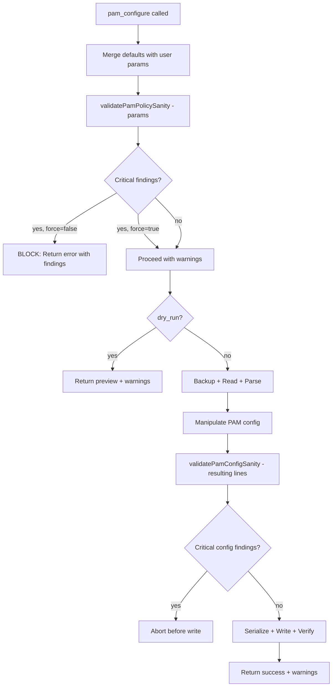

# PAM Policy Sanity Validation — Design Document

> **Status**: Implemented (v0.8.1)
> **Created**: 2026-03-26  
> **Scope**: Detect overly restrictive PAM policies that could cause user lockouts  
> **Risk**: **High** — valid-but-dangerous PAM configs bypass existing syntactic validation  
> **Predecessor**: [PAM Hardening Fix](./PAM-HARDENING-FIX.md) (fixed corrupted configs)

---

## 1. Problem Statement

The existing [`validatePamConfig()`](../src/core/pam-utils.ts:286) catches **syntactically invalid** PAM configs (missing fields, concatenated tokens, bad jump counts). However, **syntactically valid but semantically dangerous** policies pass validation unchecked.

### Real-World Scenario

An LLM agent calls `pam_configure` with `module=faillock, pam_settings={deny: 1, unlock_time: 0}`:

- `deny=1` — a single failed password attempt locks the account
- `unlock_time=0` — the lock is **permanent** until an admin runs `faillock --reset`
- The config is syntactically valid — `validatePamConfig()` passes
- The user gets locked out on their next typo

This gap exists because the current validation only checks structure, not policy sanity.

---

## 2. Solution Overview

Add a **policy sanity validation layer** that runs alongside syntactic validation. It checks module parameters and PAM config structure for dangerous patterns, returning findings with severity levels.



---

## 3. New Types

Add to [`src/core/pam-utils.ts`](../src/core/pam-utils.ts) alongside existing types:

```typescript
// ── PAM Sanity Validation Types ─────────────────────────────────────────────

/** A single finding from PAM policy sanity validation. */
export interface PamSanityFinding {
  /** warning = proceed with caution; critical = blocks operation unless forced */
  severity: "warning" | "critical";
  /** Which module the finding relates to */
  module: "pam_faillock.so" | "pam_pwquality.so" | "general";
  /** The specific parameter that triggered the finding, if applicable */
  parameter?: string;
  /** The problematic value */
  value?: string | number;
  /** Human-readable description of the problem */
  message: string;
  /** What the user should do instead */
  recommendation: string;
}

/** Result of PAM policy sanity validation. */
export interface PamSanityResult {
  /** true if no critical findings exist */
  safe: boolean;
  /** All findings, ordered by severity then module */
  findings: PamSanityFinding[];
  /** Count of critical-severity findings */
  criticalCount: number;
  /** Count of warning-severity findings */
  warningCount: number;
}
```

---

## 4. Sanity Threshold Constants

```typescript
// ── PAM Sanity Thresholds ───────────────────────────────────────────────────

/**
 * Thresholds for PAM policy sanity checks.
 * These define what constitutes "sane" vs "dangerous" PAM policy values.
 * Tuned to prevent lockouts while allowing reasonable security hardening.
 */
export const PAM_SANITY_THRESHOLDS = {
  faillock: {
    /** deny below this triggers critical — too few attempts before lockout */
    minDeny: 3,
    /** unlock_time above this triggers warning — extended lockout */
    maxUnlockTimeWarn: 1800,    // 30 minutes
    /** unlock_time above this triggers critical — extreme lockout */
    maxUnlockTimeCritical: 86400, // 24 hours
    /** fail_interval below this triggers warning — unusually short window */
    minFailInterval: 60,         // 1 minute
  },
  pwquality: {
    /** minlen above this triggers warning — unusually long */
    maxMinlenWarn: 24,
    /** minlen above this triggers critical — unreasonably long */
    maxMinlenCritical: 64,
    /** retry below this triggers critical — no second chance */
    minRetry: 2,
    /** Combined credit threshold: all credits at this or below with high minlen */
    restrictiveCreditThreshold: -2,
  },
} as const;
```

---

## 5. Function Signatures

### 5.1 Faillock Parameter Validation

```typescript
/**
 * Validate faillock parameters for policy sanity.
 *
 * Checks for overly restrictive settings that could cause lockouts:
 * - deny too low (typos cause lockout)
 * - unlock_time too high or zero (extended/permanent lockout)
 * - deny + unlock_time=0 combination (permanent lock on typos)
 * - fail_interval too short
 *
 * @param params - Faillock parameters to validate
 * @returns Array of sanity findings (empty = all sane)
 */
export function validateFaillockParams(params: {
  deny?: number;
  unlock_time?: number;
  fail_interval?: number;
}): PamSanityFinding[];
```

**Check matrix:**

| Condition | Severity | Message |
|-----------|----------|---------|
| `deny === 1` | critical | Single failed attempt locks account — typos cause immediate lockout |
| `deny === 2` | critical | Only 2 attempts before lockout — insufficient margin for typos |
| `deny < 3` (general) | critical | deny below 3 is too restrictive for normal use |
| `unlock_time === 0` | critical | Permanent lock until admin intervention — no automatic recovery |
| `unlock_time > 86400` | critical | Lockout exceeds 24 hours — effectively permanent for most users |
| `unlock_time > 1800` | warning | Lockout exceeds 30 minutes — consider a shorter unlock time |
| `deny <= 2 && unlock_time === 0` | critical | Permanent lock on typos — the most dangerous combination |
| `fail_interval < 60` | warning | Very short fail interval — rapid retries needed to trigger lockout |

### 5.2 Pwquality Parameter Validation

```typescript
/**
 * Validate pwquality parameters for policy sanity.
 *
 * Checks for overly restrictive settings that prevent password creation:
 * - minlen too high
 * - retry too low (no second chance)
 * - All character class requirements simultaneously very strict
 *
 * @param params - Pwquality parameters to validate
 * @returns Array of sanity findings (empty = all sane)
 */
export function validatePwqualityParams(params: {
  minlen?: number;
  dcredit?: number;
  ucredit?: number;
  lcredit?: number;
  ocredit?: number;
  minclass?: number;
  maxrepeat?: number;
  retry?: number;
}): PamSanityFinding[];
```

**Check matrix:**

| Condition | Severity | Message |
|-----------|----------|---------|
| `minlen > 64` | critical | Minimum password length exceeds 64 — users cannot create compliant passwords |
| `minlen > 24` | warning | Minimum password length exceeds 24 — may be difficult for users |
| `retry === 0` | critical | Zero retries — password rejected on first attempt with no recovery |
| `retry === 1` | critical | Only 1 retry — insufficient for correcting typos |
| `minclass === 4 && minlen > 16` | warning | All 4 character classes required with long minimum — very restrictive |
| All credits `<= -2` AND `minlen > 16` | warning | All character classes require 2+ chars with long minimum — very restrictive |

### 5.3 PAM Config Structure Validation

```typescript
/**
 * Validate a PAM config structure for dangerous patterns.
 *
 * Checks the resulting PamLine[] after manipulation for patterns
 * that would break authentication:
 * - pam_deny.so as first auth rule (blocks all auth)
 * - Missing pam_unix.so in auth stack
 * - Incomplete faillock setup (preauth without authfail or vice versa)
 * - Missing pam_permit.so in session stack
 *
 * @param lines - Parsed PAM config lines (after manipulation)
 * @returns Array of sanity findings
 */
export function validatePamConfigSanity(lines: PamLine[]): PamSanityFinding[];
```

**Check matrix:**

| Condition | Severity | Message |
|-----------|----------|---------|
| `pam_deny.so` is first auth rule | critical | pam_deny.so as first auth rule blocks ALL authentication |
| No `pam_unix.so` in auth stack | critical | Missing pam_unix.so in auth stack breaks basic password authentication |
| `pam_faillock.so preauth` without `authfail` | warning | Incomplete faillock: preauth present but authfail missing |
| `pam_faillock.so authfail` without `preauth` | warning | Incomplete faillock: authfail present but preauth missing |
| No `pam_permit.so` in session stack | warning | Missing pam_permit.so in session stack — sessions may fail |

### 5.4 Combined Entry Point

```typescript
/**
 * Validate PAM policy sanity — combined parameter + config check.
 *
 * This is the main entry point for sanity validation. It runs:
 * 1. Module-specific parameter checks (if module + params provided)
 * 2. Config structure checks (if lines provided)
 *
 * @param options - What to validate
 * @returns Combined sanity result with safe flag and all findings
 */
export function validatePamPolicySanity(options: {
  /** Which PAM module is being configured */
  module?: "faillock" | "pwquality";
  /** Module parameters being applied */
  params?: Record<string, unknown>;
  /** Resulting PAM config lines (after manipulation) */
  lines?: PamLine[];
}): PamSanityResult;
```

---

## 6. Integration Points in access-control.ts

### 6.1 New Zod Parameter

Add to the existing schema in [`registerAccessControlTools()`](../src/tools/access-control.ts:212):

```typescript
force: z
  .boolean()
  .optional()
  .default(false)
  .describe(
    "Force operation even if sanity checks report critical findings (pam_configure). " +
    "Use with extreme caution — may cause lockouts."
  ),
```

### 6.2 New Import

Add to existing pam-utils imports at [line 27](../src/tools/access-control.ts:27):

```typescript
import {
  // ... existing imports ...
  validatePamPolicySanity,
  type PamSanityResult,
} from "../core/pam-utils.js";
```

### 6.3 Faillock Handler Integration

Insert after the defaults merge at [line 1211](../src/tools/access-control.ts:1211) and before the dry-run check:

```typescript
// ── Sanity check: detect dangerous faillock parameters ──
const sanityResult = validatePamPolicySanity({
  module: "faillock",
  params: merged,
});

if (sanityResult.criticalCount > 0 && !(params.force)) {
  const findingsText = sanityResult.findings
    .map(f => `  [${f.severity.toUpperCase()}] ${f.message}\n    → ${f.recommendation}`)
    .join("\n");

  return {
    content: [
      createErrorContent(
        `PAM policy sanity check FAILED — ${sanityResult.criticalCount} critical finding(s):\n\n` +
        findingsText +
        `\n\nTo override, set force=true. This may cause lockouts.`
      ),
    ],
    isError: true,
  };
}

// Store warnings for inclusion in response
const sanityWarnings = sanityResult.findings
  .map(f => `[${f.severity.toUpperCase()}] ${f.message}`)
  .join("\n");
```

Also add config-level sanity check after manipulation at [line 1277](../src/tools/access-control.ts:1277), before the `writePamFile()` call:

```typescript
// Config-level sanity check on the resulting PAM structure
const configSanity = validatePamPolicySanity({ lines: recheckLines });
if (configSanity.criticalCount > 0 && !(params.force)) {
  throw new PamWriteError(
    `PAM config sanity check failed: ${configSanity.findings.map(f => f.message).join("; ")}`,
    targetFile,
    backupEntry.id,
  );
}
```

Include warnings in the success response:

```typescript
return {
  content: [
    createTextContent(
      `pam_faillock configured in ${targetFile}:\n\n` +
      `  ${preLine}\n  ${authLine}\n\n` +
      `Settings: ${JSON.stringify(merged)}\n` +
      `Backup: ${backupEntry.backupPath}` +
      (sanityWarnings ? `\n\n⚠️ Sanity warnings:\n${sanityWarnings}` : "")
    ),
  ],
};
```

### 6.4 Pwquality Handler Integration

Insert after the defaults merge at [line 1096](../src/tools/access-control.ts:1096):

```typescript
// ── Sanity check: detect dangerous pwquality parameters ──
const sanityResult = validatePamPolicySanity({
  module: "pwquality",
  params: merged,
});

if (sanityResult.criticalCount > 0 && !(params.force)) {
  const findingsText = sanityResult.findings
    .map(f => `  [${f.severity.toUpperCase()}] ${f.message}\n    → ${f.recommendation}`)
    .join("\n");

  return {
    content: [
      createErrorContent(
        `PAM policy sanity check FAILED — ${sanityResult.criticalCount} critical finding(s):\n\n` +
        findingsText +
        `\n\nTo override, set force=true. This may cause lockouts.`
      ),
    ],
    isError: true,
  };
}

const sanityWarnings = sanityResult.findings
  .map(f => `[${f.severity.toUpperCase()}] ${f.message}`)
  .join("\n");
```

### 6.5 Dry-Run Enhancement

Both dry-run paths should also show sanity warnings. Add to the dry-run response text:

```typescript
(sanityWarnings ? `\n\n⚠️ Sanity warnings:\n${sanityWarnings}` : "")
```

---

## 7. Test Cases

### 7.1 New Tests in `tests/core/pam-utils.test.ts`

#### `validateFaillockParams` Tests

```typescript
describe("validateFaillockParams", () => {
  it("returns no findings for sane defaults (deny=5, unlock_time=900)", () => {
    const findings = validateFaillockParams({ deny: 5, unlock_time: 900, fail_interval: 900 });
    expect(findings).toHaveLength(0);
  });

  it("returns critical for deny=1 (single attempt lockout)", () => {
    const findings = validateFaillockParams({ deny: 1 });
    expect(findings.some(f => f.severity === "critical" && f.parameter === "deny")).toBe(true);
  });

  it("returns critical for deny=2 (too few attempts)", () => {
    const findings = validateFaillockParams({ deny: 2 });
    expect(findings.some(f => f.severity === "critical" && f.parameter === "deny")).toBe(true);
  });

  it("returns no finding for deny=3 (boundary - acceptable)", () => {
    const findings = validateFaillockParams({ deny: 3 });
    expect(findings.filter(f => f.parameter === "deny")).toHaveLength(0);
  });

  it("returns critical for unlock_time=0 (permanent lock)", () => {
    const findings = validateFaillockParams({ unlock_time: 0 });
    expect(findings.some(f => f.severity === "critical" && f.parameter === "unlock_time")).toBe(true);
  });

  it("returns no finding for unlock_time=1800 (boundary)", () => {
    const findings = validateFaillockParams({ unlock_time: 1800 });
    expect(findings.filter(f => f.parameter === "unlock_time")).toHaveLength(0);
  });

  it("returns warning for unlock_time=1801 (just over threshold)", () => {
    const findings = validateFaillockParams({ unlock_time: 1801 });
    expect(findings.some(f => f.severity === "warning" && f.parameter === "unlock_time")).toBe(true);
  });

  it("returns critical for unlock_time=86401 (over 24 hours)", () => {
    const findings = validateFaillockParams({ unlock_time: 86401 });
    expect(findings.some(f => f.severity === "critical" && f.parameter === "unlock_time")).toBe(true);
  });

  it("returns critical for deny=1 + unlock_time=0 (worst case)", () => {
    const findings = validateFaillockParams({ deny: 1, unlock_time: 0 });
    const criticals = findings.filter(f => f.severity === "critical");
    expect(criticals.length).toBeGreaterThanOrEqual(2);
  });

  it("returns warning for fail_interval < 60", () => {
    const findings = validateFaillockParams({ fail_interval: 30 });
    expect(findings.some(f => f.severity === "warning" && f.parameter === "fail_interval")).toBe(true);
  });

  it("returns no findings when no params provided", () => {
    const findings = validateFaillockParams({});
    expect(findings).toHaveLength(0);
  });
});
```

#### `validatePwqualityParams` Tests

```typescript
describe("validatePwqualityParams", () => {
  it("returns no findings for sane defaults (minlen=14)", () => {
    const findings = validatePwqualityParams({ minlen: 14 });
    expect(findings).toHaveLength(0);
  });

  it("returns warning for minlen=25 (over 24)", () => {
    const findings = validatePwqualityParams({ minlen: 25 });
    expect(findings.some(f => f.severity === "warning" && f.parameter === "minlen")).toBe(true);
  });

  it("returns critical for minlen=65 (over 64)", () => {
    const findings = validatePwqualityParams({ minlen: 65 });
    expect(findings.some(f => f.severity === "critical" && f.parameter === "minlen")).toBe(true);
  });

  it("returns critical for retry=0", () => {
    const findings = validatePwqualityParams({ retry: 0 });
    expect(findings.some(f => f.severity === "critical" && f.parameter === "retry")).toBe(true);
  });

  it("returns critical for retry=1", () => {
    const findings = validatePwqualityParams({ retry: 1 });
    expect(findings.some(f => f.severity === "critical" && f.parameter === "retry")).toBe(true);
  });

  it("returns no finding for retry=2 (boundary)", () => {
    const findings = validatePwqualityParams({ retry: 2 });
    expect(findings.filter(f => f.parameter === "retry")).toHaveLength(0);
  });

  it("returns warning for all credits <= -2 with high minlen", () => {
    const findings = validatePwqualityParams({
      minlen: 18,
      dcredit: -2,
      ucredit: -2,
      lcredit: -2,
      ocredit: -2,
    });
    expect(findings.some(f => f.severity === "warning")).toBe(true);
  });

  it("returns warning for minclass=4 with high minlen", () => {
    const findings = validatePwqualityParams({ minclass: 4, minlen: 18 });
    expect(findings.some(f => f.severity === "warning")).toBe(true);
  });

  it("returns no findings when no params provided", () => {
    const findings = validatePwqualityParams({});
    expect(findings).toHaveLength(0);
  });
});
```

#### `validatePamConfigSanity` Tests

```typescript
describe("validatePamConfigSanity", () => {
  it("returns no findings for standard Debian common-auth", () => {
    const lines = parsePamConfig(DEBIAN_COMMON_AUTH);
    const findings = validatePamConfigSanity(lines);
    expect(findings.filter(f => f.severity === "critical")).toHaveLength(0);
  });

  it("returns critical when pam_deny.so is first auth rule", () => {
    const lines: PamLine[] = [
      createPamRule("auth", "required", "pam_deny.so", []),
      createPamRule("auth", "required", "pam_unix.so", []),
    ];
    const findings = validatePamConfigSanity(lines);
    expect(findings.some(f =>
      f.severity === "critical" && f.message.includes("pam_deny.so")
    )).toBe(true);
  });

  it("returns critical when no pam_unix.so in auth stack", () => {
    const lines: PamLine[] = [
      createPamRule("auth", "required", "pam_deny.so", []),
      createPamRule("auth", "required", "pam_permit.so", []),
    ];
    const findings = validatePamConfigSanity(lines);
    expect(findings.some(f =>
      f.severity === "critical" && f.message.includes("pam_unix.so")
    )).toBe(true);
  });

  it("returns warning for faillock preauth without authfail", () => {
    const lines: PamLine[] = [
      createPamRule("auth", "required", "pam_faillock.so", ["preauth", "silent"]),
      createPamRule("auth", "required", "pam_unix.so", []),
      createPamRule("auth", "requisite", "pam_deny.so", []),
    ];
    const findings = validatePamConfigSanity(lines);
    expect(findings.some(f =>
      f.severity === "warning" && f.message.includes("authfail")
    )).toBe(true);
  });

  it("returns warning for faillock authfail without preauth", () => {
    const lines: PamLine[] = [
      createPamRule("auth", "required", "pam_unix.so", []),
      createPamRule("auth", "[default=die]", "pam_faillock.so", ["authfail"]),
      createPamRule("auth", "requisite", "pam_deny.so", []),
    ];
    const findings = validatePamConfigSanity(lines);
    expect(findings.some(f =>
      f.severity === "warning" && f.message.includes("preauth")
    )).toBe(true);
  });

  it("returns no findings for complete faillock setup", () => {
    const lines: PamLine[] = [
      createPamRule("auth", "required", "pam_faillock.so", ["preauth", "silent", "deny=5"]),
      createPamRule("auth", "[success=2 default=ignore]", "pam_unix.so", ["nullok"]),
      createPamRule("auth", "[default=die]", "pam_faillock.so", ["authfail", "deny=5"]),
      createPamRule("auth", "requisite", "pam_deny.so", []),
      createPamRule("auth", "required", "pam_permit.so", []),
    ];
    const findings = validatePamConfigSanity(lines);
    expect(findings.filter(f => f.severity === "critical")).toHaveLength(0);
  });
});
```

#### `validatePamPolicySanity` Combined Tests

```typescript
describe("validatePamPolicySanity", () => {
  it("returns safe=true for sane faillock params", () => {
    const result = validatePamPolicySanity({
      module: "faillock",
      params: { deny: 5, unlock_time: 900, fail_interval: 900 },
    });
    expect(result.safe).toBe(true);
    expect(result.criticalCount).toBe(0);
  });

  it("returns safe=false for dangerous faillock params", () => {
    const result = validatePamPolicySanity({
      module: "faillock",
      params: { deny: 1, unlock_time: 0 },
    });
    expect(result.safe).toBe(false);
    expect(result.criticalCount).toBeGreaterThan(0);
  });

  it("combines param and config findings", () => {
    const lines: PamLine[] = [
      createPamRule("auth", "required", "pam_deny.so", []),
      createPamRule("auth", "required", "pam_unix.so", []),
    ];
    const result = validatePamPolicySanity({
      module: "faillock",
      params: { deny: 1 },
      lines,
    });
    // Should have findings from both param check AND config check
    expect(result.findings.length).toBeGreaterThan(1);
  });

  it("returns safe=true when no options provided", () => {
    const result = validatePamPolicySanity({});
    expect(result.safe).toBe(true);
    expect(result.findings).toHaveLength(0);
  });
});
```

### 7.2 Integration Tests in `tests/tools/access-control.test.ts`

```typescript
describe("pam_configure sanity checks", () => {
  it("blocks faillock with deny=1 (critical finding)", async () => {
    const result = await handler({
      action: "pam_configure",
      module: "faillock",
      pam_settings: { deny: 1, unlock_time: 0 },
      dry_run: false,
    });
    expect(result.isError).toBe(true);
    expect(result.content[0].text).toContain("sanity check FAILED");
    expect(result.content[0].text).toContain("force=true");
  });

  it("allows faillock with deny=1 when force=true", async () => {
    // Mock executeCommand for the full write flow
    const result = await handler({
      action: "pam_configure",
      module: "faillock",
      pam_settings: { deny: 1, unlock_time: 0 },
      force: true,
      dry_run: false,
    });
    // Should proceed (may succeed or fail on I/O, but not blocked by sanity)
    // The response should include warnings
  });

  it("includes sanity warnings in dry-run output", async () => {
    const result = await handler({
      action: "pam_configure",
      module: "faillock",
      pam_settings: { deny: 5, unlock_time: 3600 },
      dry_run: true,
    });
    expect(result.isError).toBeUndefined();
    expect(result.content[0].text).toContain("Sanity warnings");
    expect(result.content[0].text).toContain("unlock_time");
  });

  it("succeeds without warnings for sane defaults", async () => {
    const result = await handler({
      action: "pam_configure",
      module: "faillock",
      pam_settings: { deny: 5, unlock_time: 900, fail_interval: 900 },
      dry_run: true,
    });
    expect(result.isError).toBeUndefined();
    expect(result.content[0].text).not.toContain("Sanity warnings");
  });
});
```

---

## 8. File Change Inventory

| File | Action | Description |
|------|--------|-------------|
| [`src/core/pam-utils.ts`](../src/core/pam-utils.ts) | **MODIFY** | Add `PamSanityFinding`, `PamSanityResult`, `PAM_SANITY_THRESHOLDS`, `validateFaillockParams()`, `validatePwqualityParams()`, `validatePamConfigSanity()`, `validatePamPolicySanity()` |
| [`src/tools/access-control.ts`](../src/tools/access-control.ts) | **MODIFY** | Add `force` Zod param, import new functions, add sanity checks in faillock + pwquality handlers, include warnings in responses |
| [`tests/core/pam-utils.test.ts`](../tests/core/pam-utils.test.ts) | **MODIFY** | Add 4 new `describe` blocks with ~30 test cases |
| [`tests/tools/access-control.test.ts`](../tests/tools/access-control.test.ts) | **MODIFY** | Add integration tests for sanity check blocking/warnings |

---

## 9. Design Decisions

### 9.1 Why Warnings + Critical (Not Just Block/Allow)?

Two severity levels provide nuance:
- **Critical** = blocks by default, requires `force=true` to override
- **Warning** = proceeds but includes the warning in the response

This lets the LLM agent see warnings and decide whether to proceed, while preventing the most dangerous configurations from being applied accidentally.

### 9.2 Why a `force` Parameter?

There are legitimate reasons to set aggressive PAM policies (e.g., compliance requirements, honeypot systems). The `force` flag provides an escape hatch while ensuring the user explicitly acknowledges the risk. The findings are still included in the response even when forced.

### 9.3 Why Check Both Parameters AND Config?

Parameter checks catch dangerous values before any work is done (fast fail). Config checks catch structural problems that emerge from the manipulation (e.g., a rule ending up in the wrong position). Both are needed because:
- Parameter checks can't see the full config context
- Config checks can't see the original parameter intent

### 9.4 Why in pam-utils.ts (Not safeguards.ts)?

The existing [`SafeguardRegistry`](../src/core/safeguards.ts:149) detects **environmental state** (running apps, SSH sessions). PAM sanity validation checks **configuration values** — it's a different concern. Keeping it in `pam-utils.ts` alongside `validatePamConfig()` maintains cohesion: all PAM validation in one place.

### 9.5 Threshold Values

The thresholds are based on:
- **deny >= 3**: CIS Benchmark recommends 3-5 attempts. Below 3 causes excessive lockouts from typos.
- **unlock_time <= 1800**: 30 minutes is the CIS recommendation. Longer periods are punitive.
- **unlock_time > 0**: Zero means permanent lock — requires admin intervention, which may not be available.
- **minlen <= 24**: NIST SP 800-63B recommends 8-64 characters. Above 24 is unusual; above 64 is unreasonable.
- **retry >= 2**: Users need at least one chance to correct a typo.

---

## 10. Implementation Order

1. **`src/core/pam-utils.ts`** — Add types, constants, and all 4 validation functions
2. **`tests/core/pam-utils.test.ts`** — Add ~30 unit tests for the new functions
3. **`src/tools/access-control.ts`** — Add `force` param, import new functions, integrate sanity checks
4. **`tests/tools/access-control.test.ts`** — Add integration tests for sanity check blocking/warnings
5. **Run `npm test`** — Verify all existing + new tests pass