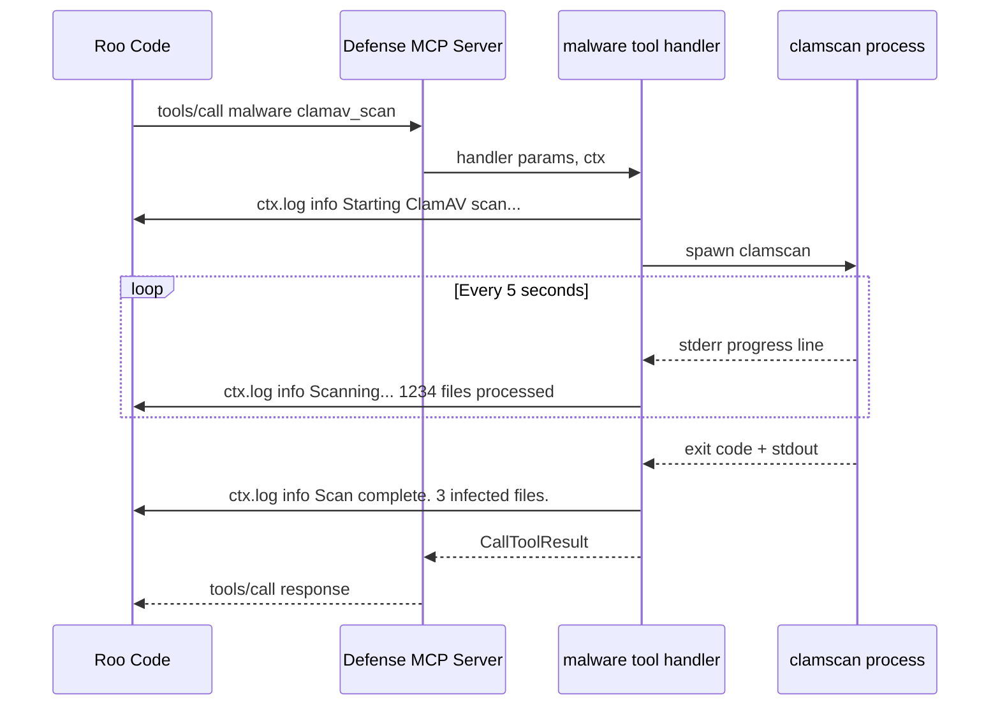

# Malware Tool Context Explosion — Architectural Design

## ADR: Smart Truncation & Progress Reporting for Defense MCP Server

**Status**: Proposed  
**Date**: 2026-03-30  
**Scope**: `src/core/parsers.ts`, `src/tools/malware.ts`, `src/core/progress.ts`, `src/core/tool-wrapper.ts`

---

## 1. Problem Analysis

### 1.1 The Global 100KB Truncation Problem

The current fix in [`formatToolOutput()`](src/core/parsers.ts:97) applies a hard 100KB byte-slice truncation to ALL tool outputs:

```typescript
if (text.length > MAX_OUTPUT_SIZE) {
  text = text.slice(0, MAX_OUTPUT_SIZE) +
    `\n\n... [OUTPUT TRUNCATED: ${truncatedSize} bytes exceeded ${MAX_OUTPUT_SIZE} byte limit.]`;
}
```

**Why this is problematic:**

1. **Byte-slicing breaks JSON structure.** When the output is a JSON-stringified object, slicing at 100KB can cut mid-key, mid-value, or mid-array — producing invalid JSON that the LLM cannot parse.

2. **It truncates actionable data indiscriminately.** A ClamAV scan finding 500 infected files produces structured findings that are ALL actionable. The current approach might preserve 400 findings and corrupt the 401st, losing the summary metadata at the end.

3. **It doesn't distinguish findings from noise.** ClamAV's raw stdout contains thousands of `/path/to/file: OK` lines (diagnostic noise) alongside the critical `FOUND` lines (actionable findings). The current approach treats both equally.

### 1.2 Concrete Examples of the Problem

#### Example A: ClamAV scan of /home with 50,000 files

**Raw ClamAV stdout**: ~5MB (50,000 lines of `/path: OK` + 3 lines of `FOUND` + summary block)

**Current flow in [`malware.ts`](src/tools/malware.ts:107)**:
1. `executeCommand()` runs `clamscan` — captures full stdout (capped at 10MB by executor)
2. `parseClamavOutput()` parses ALL lines into `ClamavResult[]` — 50,003 objects
3. `extractClamavSummary()` extracts the summary block (~500 chars) ✅ Good
4. BUT: the response object includes `findings: infected` (only FOUND items) — this is fine
5. `formatToolOutput()` JSON-stringifies the response — typically small (~2KB for 3 findings)

**Verdict**: For ClamAV, the current malware.ts code is actually well-designed — it already filters to only infected files. The 100KB limit is a safety net that rarely triggers here.

#### Example B: `file_scan_suspicious` on / with check_type=all

**Current flow in [`malware.ts`](src/tools/malware.ts:334)**:
1. Runs 5 `find` commands (suid, sgid, world_writable, hidden_executables, recently_modified)
2. Each can return thousands of results
3. Already caps at `MAX_RESULTS_PER_CATEGORY = 500` per category ✅ Good
4. But 5 categories × 500 results × ~80 chars/path = ~200KB — exceeds 100KB limit
5. `formatToolOutput()` truncates at 100KB, breaking the JSON mid-array

**Verdict**: This is a real problem. The per-category cap of 500 is reasonable, but 5 categories combined can exceed the global limit. The truncation corrupts the structured output.

#### Example C: YARA scan with many matches

**Current flow in [`malware.ts`](src/tools/malware.ts:256)**:
1. Already caps findings at 500 with `findings.slice(0, 500)` ✅ Good
2. Includes `truncatedFrom` metadata when truncated ✅ Good
3. 500 findings × ~100 chars = ~50KB — under the 100KB limit
4. But if rules_path matches many rules per file, each finding is larger

**Verdict**: Generally fine, but the 500-item cap is arbitrary and not coordinated with the 100KB byte limit.

### 1.3 Survey of Existing Truncation Patterns Across Tools

The codebase already has extensive ad-hoc truncation. Here's the pattern inventory:

| Tool | Truncation Strategy | Limit | Coordinated with 100KB? |
|------|-------------------|-------|------------------------|
| [`malware.ts`](src/tools/malware.ts:321) YARA | `findings.slice(0, 500)` | 500 items | No |
| [`malware.ts`](src/tools/malware.ts:363) suspicious | `slice(0, 500)` per category | 500/cat | No — 5×500 can exceed |
| [`malware.ts`](src/tools/malware.ts:422) webshell | `slice(0, 20)` for details | 20 items | Yes (small) |
| [`supply-chain-security.ts`](src/tools/supply-chain-security.ts:119) SBOM | `stdout.slice(0, 50000)` | 50KB raw | No — under 100KB |
| [`supply-chain-security.ts`](src/tools/supply-chain-security.ts:173) packages | `slice(0, 200)` + `truncated` flag | 200 items | Roughly |
| [`vulnerability-management.ts`](src/tools/vulnerability-management.ts:470) nmap | `stdout.slice(0, 5000)` | 5KB raw | Yes |
| [`process-security.ts`](src/tools/process-security.ts:326) processes | `slice(0, 50)` | 50 items | Yes |
| [`incident-response.ts`](src/tools/incident-response.ts:790) timeline | `slice(0, 200)` | 200 items | Roughly |
| [`secrets.ts`](src/tools/secrets.ts:593) scan | `slice(0, 50)` | 50 items | Yes |
| [`integrity.ts`](src/tools/integrity.ts:1297) baseline | `slice(0, 50)` per type | 50/type | Yes |
| [`threat-intel.ts`](src/tools/threat-intel.ts:776) blocklist | `MAX_BATCH_SIZE` | Configurable | Yes |
| [`logging.ts`](src/tools/logging.ts:850) auditd | `slice(-maxLines)` | User param | Depends |
| [`patch-management.ts`](src/tools/patch-management.ts:201) updates | `slice(0, 100)` | 100 items | Yes |

**Key observation**: Every tool has its own ad-hoc truncation with different limits, none coordinated with the global 100KB cap. The global cap is a blunt safety net that can corrupt structured output when tool-level caps are insufficient.

### 1.4 Missing Progress Visibility

The [`progress.ts`](src/core/progress.ts) module provides:
- Pre-execution duration banners (`generateDurationBanner()`)
- Post-execution timing summaries (`generateTimingSummary()`)
- Progress bar rendering (`renderProgressBar()`)
- Phase banners for multi-step workflows (`generatePhaseBanner()`)

**What's already used in malware.ts**:
- `startTiming()` / `generateTimingSummary()` — for ClamAV scan timing ✅
- `generateDurationBanner()` — prepended to ClamAV output ✅

**What's NOT used**:
- `renderProgressBar()` — never called from any tool
- Real-time progress during scan execution — impossible with current architecture

**The fundamental constraint**: MCP tools return a single response. There is no streaming. The tool handler runs to completion, then returns the full result. Progress bars in the response are post-hoc decoration, not real-time feedback.

**However**: MCP SDK v1.27.1 supports `ctx.mcpReq.log()` for sending logging notifications during tool execution. These are sent as `notifications/message` to the client. Roo Code (the MCP client) would need to handle these notifications to display progress — but the MCP protocol supports it.

---

## 2. Proposed Solution: Structured Output with Smart Truncation

### 2.1 Design Principle: Separate Findings from Diagnostics at the Source

Instead of truncating the final serialized output, structure the response so that:
1. **Findings** (actionable security data) are always preserved up to a reasonable item limit
2. **Diagnostics** (per-file status, debug info) are summarized, never included verbatim
3. **Metadata** (counts, truncation info, timing) is always included
4. **Raw output** is never included unless explicitly small

### 2.2 New Response Envelope: `StructuredToolResponse`

```typescript
// src/core/parsers.ts — new type

interface StructuredToolResponse<T = unknown> {
  /** Tool and action that produced this response */
  tool: string;
  action: string;

  /** Summary — always included, always first, always under 2KB */
  summary: {
    status: "clean" | "findings" | "error";
    headline: string;        // e.g., "3 infected files found in /home"
    totalFindings: number;
    totalScanned?: number;
    duration?: string;
  };

  /** Actionable findings — capped at MAX_FINDINGS items */
  findings: T[];

  /** Truncation metadata — present only when findings were capped */
  truncation?: {
    totalAvailable: number;
    displayed: number;
    reason: string;          // e.g., "Capped at 200 findings to stay within output limits"
  };

  /** Timing metadata */
  timing?: {
    banner: string;
    elapsed: string;
    estimate: string;
  };
}
```

### 2.3 New `formatStructuredOutput()` Function

Replace the blunt `formatToolOutput()` with a smarter function that understands the response structure:

```typescript
// src/core/parsers.ts — new function

const MAX_FINDINGS = 200;           // Default max findings per response
const MAX_FINDING_SIZE = 500;       // Max chars per individual finding
const METADATA_RESERVE = 2048;      // Reserve 2KB for summary + truncation metadata
const MAX_OUTPUT_SIZE = 100 * 1024; // Keep the 100KB safety limit

interface FormatOptions {
  /** Override max findings count (default: 200) */
  maxFindings?: number;
  /** Override max output size in bytes (default: 100KB) */
  maxOutputSize?: number;
  /** Key in the data object that contains the findings array */
  findingsKey?: string;
  /** Keys to always preserve (summary, metadata) */
  preserveKeys?: string[];
}

function formatStructuredOutput(
  data: Record<string, unknown>,
  options: FormatOptions = {}
): McpTextContent {
  const maxFindings = options.maxFindings ?? MAX_FINDINGS;
  const maxSize = options.maxOutputSize ?? MAX_OUTPUT_SIZE;
  const findingsKey = options.findingsKey ?? "findings";
  const preserveKeys = options.preserveKeys ?? ["summary", "truncation", "timing", "tool", "action"];

  // Step 1: Extract findings array
  const findings = Array.isArray(data[findingsKey]) ? data[findingsKey] : [];
  const totalFindings = findings.length;

  // Step 2: Build output with findings capped
  const output = { ...data };
  if (totalFindings > maxFindings) {
    output[findingsKey] = findings.slice(0, maxFindings);
    output.truncation = {
      totalAvailable: totalFindings,
      displayed: maxFindings,
      reason: `Showing first ${maxFindings} of ${totalFindings} findings. Use more specific parameters to narrow results.`,
    };
  }

  // Step 3: Serialize and check size
  let text = JSON.stringify(output, null, 2);

  // Step 4: If still over limit, progressively reduce findings
  if (text.length > maxSize) {
    const reducedCount = Math.floor(maxFindings / 2);
    output[findingsKey] = findings.slice(0, reducedCount);
    output.truncation = {
      totalAvailable: totalFindings,
      displayed: reducedCount,
      reason: `Output exceeded ${Math.round(maxSize / 1024)}KB limit. Showing first ${reducedCount} of ${totalFindings} findings.`,
    };
    text = JSON.stringify(output, null, 2);
  }

  // Step 5: Final safety truncation (should rarely trigger)
  if (text.length > maxSize) {
    // Preserve the structure by re-serializing with minimal findings
    output[findingsKey] = findings.slice(0, 10);
    output.truncation = {
      totalAvailable: totalFindings,
      displayed: 10,
      reason: `Output severely exceeded limits. Showing only 10 of ${totalFindings} findings. Use more specific scan parameters.`,
    };
    text = JSON.stringify(output, null, 2);
  }

  return { type: "text", text };
}
```

**Key improvement**: This function progressively reduces findings count rather than byte-slicing, so the JSON structure is always valid and the summary/metadata is always preserved.

### 2.4 Keep `formatToolOutput()` as Safety Net

The existing `formatToolOutput()` remains as a last-resort safety net for tools that haven't migrated to structured output. But its truncation message should be improved:

```typescript
function formatToolOutput(data: unknown): McpTextContent {
  let text: string;
  if (typeof data === "string") {
    text = data;
  } else {
    text = JSON.stringify(data, null, 2);
  }

  if (text.length > MAX_OUTPUT_SIZE) {
    const truncatedSize = text.length;
    // Try to find a clean JSON boundary to truncate at
    const safePoint = findJsonSafeTruncationPoint(text, MAX_OUTPUT_SIZE);
    text = text.slice(0, safePoint) +
      `\n\n... [OUTPUT TRUNCATED: ${(truncatedSize / 1024).toFixed(0)}KB exceeded ${MAX_OUTPUT_SIZE / 1024}KB limit. ` +
      `${truncatedSize - safePoint} bytes omitted. Use more specific parameters to reduce output.]`;
  }

  return { type: "text", text };
}

/** Find the last complete JSON value boundary before maxLen */
function findJsonSafeTruncationPoint(text: string, maxLen: number): number {
  // Walk backwards from maxLen to find a newline that's likely a JSON boundary
  let pos = maxLen;
  while (pos > maxLen - 1000 && pos > 0) {
    if (text[pos] === "\n" && (text[pos - 1] === "," || text[pos - 1] === "{" || text[pos - 1] === "[")) {
      return pos;
    }
    pos--;
  }
  return maxLen; // fallback to hard cut
}
```

---

## 3. Proposed Solution: Progress Reporting via MCP Logging

### 3.1 MCP SDK Logging Capability

The MCP SDK v1.27.1 supports server-to-client logging notifications via `ctx.mcpReq.log(level, data)`. This requires:

1. **Server declares logging capability** — add `{ logging: {} }` to McpServer capabilities
2. **Tool handlers receive `ctx` parameter** — the second argument to tool callbacks
3. **Client handles `notifications/message`** — Roo Code must display these

### 3.2 Architecture: Progress via MCP Logging Notifications



### 3.3 Implementation: Progress Logger Utility

```typescript
// src/core/progress.ts — new addition

import type { RequestHandlerExtra } from "@modelcontextprotocol/sdk/shared/protocol.js";

/**
 * Progress reporter that sends MCP logging notifications during tool execution.
 * Falls back to console.error if MCP context is not available.
 */
export class ProgressReporter {
  private ctx: RequestHandlerExtra | undefined;
  private toolName: string;
  private action: string;
  private startTime: number;
  private lastUpdate: number = 0;
  private minIntervalMs: number;

  constructor(
    toolName: string,
    action: string,
    ctx?: RequestHandlerExtra,
    minIntervalMs = 3000  // Don't spam — max 1 update per 3 seconds
  ) {
    this.toolName = toolName;
    this.action = action;
    this.ctx = ctx;
    this.startTime = Date.now();
    this.minIntervalMs = minIntervalMs;
  }

  /** Send a progress update (throttled) */
  async update(message: string, percent?: number): Promise<void> {
    const now = Date.now();
    if (now - this.lastUpdate < this.minIntervalMs) return;
    this.lastUpdate = now;

    const elapsed = formatElapsed(now - this.startTime);
    const bar = percent !== undefined ? ` ${renderProgressBar(percent)}` : "";
    const logMsg = `[${this.toolName}:${this.action}] ${message}${bar} (${elapsed})`;

    if (this.ctx?.log) {
      await this.ctx.log("info", logMsg);
    } else {
      console.error(logMsg);
    }
  }

  /** Send a completion message (always sent, not throttled) */
  async complete(message: string): Promise<void> {
    const elapsed = formatElapsed(Date.now() - this.startTime);
    const logMsg = `[${this.toolName}:${this.action}] ✅ ${message} (${elapsed})`;

    if (this.ctx?.log) {
      await this.ctx.log("info", logMsg);
    } else {
      console.error(logMsg);
    }
  }
}
```

### 3.4 Integration with ClamAV Scan

ClamAV writes progress to stderr during scanning. We can monitor stderr in real-time:

```typescript
// In malware.ts clamav_scan handler — conceptual change

// Instead of:
const result = await executeCommand({ command: "clamscan", args, ... });

// Use a new executeWithProgress() that streams stderr:
const result = await executeWithProgress({
  command: "clamscan",
  args,
  toolName: "malware",
  timeout: actionTimeout,
  progress: new ProgressReporter("malware", "clamav_scan", ctx),
  stderrParser: (line: string) => {
    // ClamAV writes "Scanning /path/to/dir" to stderr
    const match = line.match(/^Scanning\s+(.+)/);
    if (match) return `Scanning ${match[1]}`;
    return null; // ignore non-progress lines
  },
});
```

### 3.5 New `executeWithProgress()` in executor.ts

```typescript
// src/core/executor.ts — new function

interface ExecuteWithProgressOptions extends ExecuteCommandOptions {
  progress: ProgressReporter;
  /** Parse stderr lines for progress messages. Return null to skip. */
  stderrParser?: (line: string) => string | null;
  /** Parse stdout lines for progress messages. Return null to skip. */
  stdoutParser?: (line: string) => string | null;
}

async function executeWithProgress(
  options: ExecuteWithProgressOptions
): Promise<ExecuteResult> {
  const { progress, stderrParser, stdoutParser, ...execOpts } = options;

  // Use spawn directly (not the buffered executeCommand)
  // to get real-time stderr access
  return new Promise((resolve, reject) => {
    const proc = spawn(command, args, spawnOptions);
    let stdout = "";
    let stderr = "";
    let lineCount = 0;

    proc.stderr?.on("data", (chunk: Buffer) => {
      const text = chunk.toString();
      stderr += text;
      if (stderrParser) {
        for (const line of text.split("\n")) {
          const msg = stderrParser(line.trim());
          if (msg) {
            lineCount++;
            progress.update(msg).catch(() => {});
          }
        }
      }
    });

    proc.stdout?.on("data", (chunk: Buffer) => {
      const text = chunk.toString();
      stdout += text;
      if (stdoutParser) {
        for (const line of text.split("\n")) {
          const msg = stdoutParser(line.trim());
          if (msg) progress.update(msg).catch(() => {});
        }
      }
    });

    proc.on("close", (code) => {
      progress.complete(`Processed ${lineCount} items`).catch(() => {});
      resolve({ stdout, stderr, exitCode: code ?? 0 });
    });
  });
}
```

### 3.6 Passing `ctx` Through the Tool Wrapper

The tool wrapper in [`tool-wrapper.ts`](src/core/tool-wrapper.ts:237) already passes `callbackArgs` to the original handler. The MCP SDK provides the `extra` context as the second argument to tool handlers. Currently, tool handlers only destructure `params` (the first argument).

**Required change**: Tool handlers that need progress must accept the second argument:

```typescript
// Current signature in malware.ts:
async (params) => { ... }

// New signature:
async (params, extra) => {
  const ctx = extra; // Contains .log() for MCP notifications
  ...
}
```

**Important**: The `extra` parameter is already passed by the MCP SDK. No changes to `tool-wrapper.ts` are needed — the proxy already forwards all arguments.

### 3.7 Roo Code Client Compatibility

**Critical question**: Does Roo Code display `notifications/message` from MCP servers?

Based on the MCP SDK documentation, `notifications/message` is a standard MCP notification type. Roo Code, as an MCP client, should handle these. However:

- If Roo Code does NOT display these notifications, the progress updates are silently dropped (no harm done — the tool still completes normally)
- The `ProgressReporter` falls back to `console.error` which appears in the MCP server's stderr log
- This is a **progressive enhancement** — it works without client support

---

## 4. Architectural Recommendations

### 4.1 Response Structure: Findings vs Diagnostics

**Recommendation**: Adopt a standard response envelope for all security tools that produce findings.

```
┌─────────────────────────────────────────────┐
│ Response Envelope                            │
├─────────────────────────────────────────────┤
│ summary: { status, headline, counts }        │  ← Always present, <2KB
│ findings: [ ... ]                            │  ← Actionable items, capped
│ truncation?: { total, displayed, reason }    │  ← Present when capped
│ timing?: { elapsed, estimate }               │  ← Present for long-running
│ recommendations?: [ ... ]                    │  ← Optional remediation hints
└─────────────────────────────────────────────┘
```

**What goes in `findings`** (actionable):
- Infected files (ClamAV)
- YARA rule matches
- SUID/SGID binaries
- World-writable files
- Webshell pattern matches
- Compliance failures
- Vulnerability detections

**What does NOT go in `findings`** (diagnostic noise):
- Per-file "OK" status lines
- Debug/verbose output
- Raw command stdout
- Progress messages
- ClamAV scan summary (goes in `summary` instead)

### 4.2 Progress: MCP Logging vs Embedded in Response

**Recommendation**: Use BOTH approaches.

| Approach | When | How |
|----------|------|-----|
| MCP `ctx.log()` notifications | During execution | Real-time progress for clients that support it |
| Duration banner in response | Pre-execution | Already implemented in `progress.ts` |
| Timing summary in response | Post-execution | Already implemented in `progress.ts` |

The MCP logging approach is a **progressive enhancement**. If the client doesn't display notifications, the user still gets the pre/post timing information in the response.

### 4.3 Pagination for Large Result Sets

**Recommendation**: Do NOT implement pagination.

MCP tools are stateless request-response. Implementing pagination would require:
- Server-side state (storing partial results between calls)
- A pagination token parameter
- Client awareness of pagination

This adds significant complexity for minimal benefit. Instead:

1. **Cap findings at a reasonable limit** (200 items default, configurable per tool)
2. **Include truncation metadata** so the LLM knows data was omitted
3. **Suggest narrower parameters** in the truncation message
4. **Let the user re-run with narrower scope** (e.g., scan a subdirectory instead of /)

### 4.4 Trade-offs: Context Efficiency vs Reporting Completeness

| Approach | Context Cost | Completeness | Recommendation |
|----------|-------------|--------------|----------------|
| No limit | Unbounded (can be 5MB+) | 100% | ❌ Crashes LLM context |
| 100KB hard slice | ~25K tokens max | Corrupted JSON | ❌ Current approach — broken |
| 200 findings + metadata | ~15-30K tokens | 95%+ actionable | ✅ Proposed approach |
| 50 findings + metadata | ~5-10K tokens | 80% actionable | ✅ For token-sensitive contexts |
| Summary only (0 findings) | ~1K tokens | 0% detail | ⚠️ Only for overview scans |

**The sweet spot**: 200 findings with truncation metadata. This covers the vast majority of real-world scans (most systems have <200 security findings) while keeping context under ~30KB.

For the rare case of 10,000+ findings, the truncation metadata tells the LLM: "There are 10,000 findings. I'm showing the first 200. Suggest the user narrow the scan scope."

---

## 5. Implementation Plan

### Phase 1: Fix the Immediate Problem (Priority: HIGH)

**Goal**: Prevent JSON corruption from the global 100KB truncation.

| # | Task | File | Description |
|---|------|------|-------------|
| 1.1 | Add `formatStructuredOutput()` | `src/core/parsers.ts` | New function that progressively reduces findings instead of byte-slicing |
| 1.2 | Migrate `clamav_scan` | `src/tools/malware.ts` | Use `formatStructuredOutput()` with `findingsKey: "findings"` |
| 1.3 | Migrate `file_scan_suspicious` | `src/tools/malware.ts` | Restructure to use findings array instead of per-category objects |
| 1.4 | Migrate `yara_scan` | `src/tools/malware.ts` | Already close — just switch to `formatStructuredOutput()` |
| 1.5 | Improve `formatToolOutput()` safety | `src/core/parsers.ts` | Add `findJsonSafeTruncationPoint()` for non-migrated tools |
| 1.6 | Add tests | `tests/core/parsers.test.ts` | Test progressive truncation, JSON validity, metadata preservation |

### Phase 2: Progress Reporting (Priority: MEDIUM)

**Goal**: Send real-time progress during long-running scans.

| # | Task | File | Description |
|---|------|------|-------------|
| 2.1 | Add `logging` capability | `src/index.ts` | Add `{ logging: {} }` to McpServer capabilities |
| 2.2 | Create `ProgressReporter` class | `src/core/progress.ts` | MCP-aware progress reporter with throttling |
| 2.3 | Add `executeWithProgress()` | `src/core/executor.ts` | Spawn-based execution with real-time stderr monitoring |
| 2.4 | Integrate with `clamav_scan` | `src/tools/malware.ts` | Pass `ctx` to handler, create ProgressReporter |
| 2.5 | Integrate with `yara_scan` | `src/tools/malware.ts` | Same pattern |
| 2.6 | Integrate with `file_scan_suspicious` | `src/tools/malware.ts` | Progress per check type |
| 2.7 | Add tests | `tests/core/progress.test.ts` | Test ProgressReporter throttling, fallback behavior |

### Phase 3: Standardize Across All Tools (Priority: LOW)

**Goal**: Apply the structured output pattern to other tools with large outputs.

| # | Task | Files | Description |
|---|------|-------|-------------|
| 3.1 | Migrate `supply-chain-security.ts` | SBOM output | Replace `stdout.slice(0, 50000)` with structured output |
| 3.2 | Migrate `incident-response.ts` | Timeline, IOC scan | Structured findings with truncation metadata |
| 3.3 | Migrate `compliance.ts` | Lynis, CIS results | Structured findings |
| 3.4 | Migrate `secrets.ts` | Scan results | Already close — just add metadata |
| 3.5 | Migrate `integrity.ts` | Baseline comparison | Structured drift findings |
| 3.6 | Migrate `process-security.ts` | Process audit | Structured anomaly findings |
| 3.7 | Add progress to `compliance:lynis_audit` | Long-running scan | ProgressReporter integration |
| 3.8 | Add progress to `integrity:rootkit_*` | Long-running scans | ProgressReporter integration |

---

## 6. Detailed Design: `file_scan_suspicious` Restructuring

This action is the most problematic because it produces 5 categories of results that can collectively exceed 100KB. Here's the proposed restructuring:

### Current Structure (problematic)

```json
{
  "searchPath": "/",
  "checkType": "all",
  "totalFindings": 2500,
  "categories": {
    "suid": ["/usr/bin/sudo", "/usr/bin/passwd", ...],        // 500 items
    "sgid": ["/usr/bin/wall", ...],                            // 200 items
    "world_writable": ["/tmp/foo", ...],                       // 500 items
    "hidden_executables": ["/home/user/.local/bin/x", ...],    // 300 items
    "recently_modified": ["/etc/hosts", ...],                  // 500 items
    "recently_modified_truncated_from": ["2000 total results"] // metadata
  }
}
```

### Proposed Structure

```json
{
  "tool": "malware",
  "action": "file_scan_suspicious",
  "summary": {
    "status": "findings",
    "headline": "2500 suspicious files found across 5 categories",
    "totalFindings": 2500,
    "totalScanned": null,
    "categoryCounts": {
      "suid": 800,
      "sgid": 200,
      "world_writable": 1000,
      "hidden_executables": 300,
      "recently_modified": 2000
    }
  },
  "findings": [
    { "category": "suid", "path": "/usr/bin/sudo", "severity