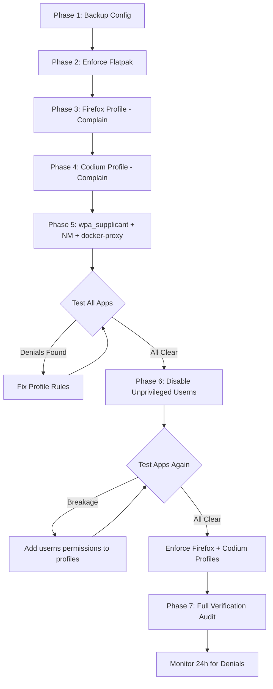

# AppArmor Hardening Plan — Debian Maximum Security

**Date:** 2026-03-16  
**System:** Debian (lilguy)  
**Security Posture:** Maximum — accept breakage, fix as needed  
**Baseline:** Output from `apparmor-audit.sh` and `sudo aa-unconfined`

---

## Warnings Being Addressed

| # | Warning | Severity |
|---|---------|----------|
| 1 | 15 processes with network access NOT confined by AppArmor | High |
| 2 | Flatpak profile in COMPLAIN mode | Medium |
| 3 | Firefox — INSTALLED but has NO AppArmor profile | High |
| 4 | Codium — INSTALLED but has NO AppArmor profile | High |
| 5 | Unprivileged user namespaces ENABLED | Medium |

## Unconfined Process Breakdown

From `sudo aa-unconfined`:

| Process | Binary | Count | Risk | Plan |
|---------|--------|-------|------|------|
| docker-proxy | `/usr/bin/docker-proxy` | 10 | Medium | Docker-managed; confine via Docker AppArmor integration |
| codium | `/usr/share/codium/codium` | 4 | High | Create custom profile |
| wpa_supplicant | `/usr/sbin/wpa_supplicant` | 1 | Medium | Install/create profile |
| NetworkManager | `/usr/sbin/NetworkManager` | 1 | Medium | Install/create profile |
| chronyd | `/usr/sbin/chronyd` | 1 | ✅ Already confined | No action needed |

---

## Phase 1: Backup Current Configuration

**Goal:** Create a restorable snapshot before making any changes.

### Actions
1. Create timestamped backup of `/etc/apparmor.d/` to `/root/apparmor-backup-YYYYMMDD/`
2. Export current `aa-status` output to backup directory
3. Save current sysctl values related to namespaces
4. Save GRUB/kernel parameter config

### Script Logic
```bash
BACKUP_DIR="/root/apparmor-backup-$(date +%Y%m%d-%H%M%S)"
mkdir -p "$BACKUP_DIR"
cp -a /etc/apparmor.d/ "$BACKUP_DIR/apparmor.d/"
aa-status > "$BACKUP_DIR/aa-status-before.txt" 2>&1
sysctl kernel.unprivileged_userns_clone > "$BACKUP_DIR/sysctl-userns.txt" 2>&1
cp /etc/default/grub "$BACKUP_DIR/grub.default" 2>/dev/null
```

### Rollback
```bash
# To restore:
sudo cp -a /root/apparmor-backup-YYYYMMDD/apparmor.d/* /etc/apparmor.d/
sudo systemctl restart apparmor
```

---

## Phase 2: Enforce Flatpak Profile

**Goal:** Move the Flatpak AppArmor profile from complain mode to enforce mode.

### Risk Assessment
- **Low risk** — Flatpak already uses its own sandbox; AppArmor enforce adds defense-in-depth
- Flatpak apps may log denials initially; monitor with `journalctl -k | grep DENIED`

### Actions
1. Verify the Flatpak profile exists at `/etc/apparmor.d/flatpak`
2. Switch from complain to enforce: `aa-enforce /etc/apparmor.d/flatpak`
3. Reload the profile: `apparmor_parser -r /etc/apparmor.d/flatpak`
4. Test a Flatpak application launches correctly

### Verification
```bash
aa-status | grep -A1 flatpak  # Should show "enforce"
```

---

## Phase 3: Create Firefox AppArmor Profile

**Goal:** Confine Firefox with an enforcing AppArmor profile.

### Risk Assessment
- **Medium risk** — Firefox needs access to GPU, audio, Wayland/X11, dbus, downloads
- Deploy in **complain mode first**, test, then enforce

### Profile Strategy
Write a custom profile at `/etc/apparmor.d/usr.bin.firefox` based on known Firefox requirements:

### Required Permissions
| Category | Access Needed |
|----------|--------------|
| **Network** | Full TCP/UDP for browsing |
| **Filesystem Read** | `/usr/lib/firefox/`, `/etc/fonts/`, `/usr/share/fonts/`, `/etc/ssl/`, system libs |
| **Filesystem R/W** | `~/.mozilla/`, `~/.cache/mozilla/`, `~/Downloads/`, `/tmp/` |
| **Display** | Wayland socket, X11 socket, GPU DRI devices |
| **Audio** | PulseAudio/PipeWire sockets |
| **DBus** | Session bus for desktop integration |
| **IPC** | Shared memory for multi-process architecture |
| **Capabilities** | `sys_admin` for sandboxing, `sys_chroot`, `sys_ptrace` for crash reporter |
| **User NS** | Required for content process sandbox |

### Deployment Steps
1. Write profile to `/etc/apparmor.d/usr.bin.firefox`
2. Create local override directory: `/etc/apparmor.d/local/usr.bin.firefox`
3. Load in complain mode: `aa-complain /etc/apparmor.d/usr.bin.firefox`
4. Test Firefox thoroughly — browsing, downloads, video playback, extensions
5. Review denials: `journalctl -k | grep firefox | grep DENIED`
6. Add any missing rules to local override file
7. Switch to enforce: `aa-enforce /etc/apparmor.d/usr.bin.firefox`

---

## Phase 4: Create Codium AppArmor Profile

**Goal:** Confine VSCodium with an enforcing AppArmor profile.

### Risk Assessment
- **High risk** — Electron app needing broad filesystem access, terminal spawning, extension host, node.js
- Deploy in **complain mode first**, iterate, then enforce
- This will be the most complex profile

### Required Permissions
| Category | Access Needed |
|----------|--------------|
| **Network** | Full TCP/UDP for extensions marketplace, git remotes, language servers |
| **Network - MCP** | TCP connections to `localhost:*` for Docker-hosted MCP servers |
| **Filesystem Read** | Broad read access for editing project files, system headers, docs |
| **Filesystem R/W** | `~/.config/VSCodium/`, `~/.vscode-oss/`, project directories, `/tmp/` |
| **Docker Socket** | `/var/run/docker.sock` — required if MCP configs use Docker socket transport |
| **Exec** | `/bin/bash`, `/bin/sh`, `node`, `npx`, `git`, `python`, `docker`, build tools |
| **Display** | Wayland/X11, GPU |
| **Audio** | Notification sounds |
| **DBus** | Desktop integration, file chooser portal |
| **IPC** | Shared memory for Electron multi-process |
| **User NS** | Required for Electron sandbox |

### ⚠️ Critical: MCP Server Connectivity
VSCodium with Roo/Cline extension communicates with MCP servers hosted in Docker containers. The profile MUST allow:
1. **TCP to localhost on any port** — MCP servers are exposed via docker-proxy port bindings
2. **Unix socket `/var/run/docker.sock`** — Some MCP stdio transports spawn via `docker exec`
3. **Execute `docker`, `node`, `npx`** — stdio-transport MCP servers are spawned as child processes
4. **Read/write workspace files** — Filesystem MCP server accesses project directories

If any of these are blocked, MCP tools will fail silently or return connection errors.

### Deployment Steps
1. Write profile to `/etc/apparmor.d/usr.bin.codium`
2. Include sub-profiles for child processes: extension host, terminal, node
3. Create local override: `/etc/apparmor.d/local/usr.bin.codium`
4. Load in complain mode: `aa-complain /etc/apparmor.d/usr.bin.codium`
5. Test Codium: open projects, use terminal, install extension, git operations
6. **Test MCP connectivity: verify all MCP servers respond via Roo**
7. Review and fix denials iteratively
8. Switch to enforce: `aa-enforce /etc/apparmor.d/usr.bin.codium`

### Special Considerations
- Codium spawns many child processes; profile needs `child` profile or `Cx` transitions
- Terminal access means the profile must allow executing arbitrary commands in a sub-profile
- Consider using `px` transitions for git, node to their own profiles
- MCP stdio servers are spawned as child processes of Codium — profile must allow this exec chain

---

## Phase 5: Confine Remaining Network Processes

### 5a: wpa_supplicant Profile

**Binary:** `/usr/sbin/wpa_supplicant`  
**Runs as:** root  
**Risk:** Handles WiFi authentication — a compromised wpa_supplicant could intercept credentials

**Approach:** Check if `apparmor-profiles` package provides one, otherwise create custom.

```bash
# Check if profile exists in package
dpkg -L apparmor-profiles 2>/dev/null | grep wpa_supplicant
apt-cache search apparmor | grep -i wpa
```

Required permissions: raw network sockets, `/etc/wpa_supplicant/`, `/run/wpa_supplicant/`, D-Bus system bus, netlink sockets.

### 5b: NetworkManager Profile

**Binary:** `/usr/sbin/NetworkManager`  
**Runs as:** root  
**Risk:** Controls all network interfaces — high-value target

**Approach:** NetworkManager is complex with many plugins. Check for upstream profile first.

Required permissions: full network capability, `/etc/NetworkManager/`, `/var/lib/NetworkManager/`, `/run/NetworkManager/`, D-Bus system bus, `CAP_NET_ADMIN`, `CAP_NET_RAW`, can execute dispatcher scripts, dhclient, resolvconf.

### 5c: docker-proxy

**Binary:** `/usr/bin/docker-proxy`  
**Runs as:** root  
**Risk:** Binds host ports for container port-forwarding

**Approach:** Docker has built-in AppArmor support. The recommended approach is:
1. Ensure Docker daemon applies default AppArmor profile to containers: `docker-default`
2. For `docker-proxy` itself, create a minimal profile allowing only network binding
3. Alternatively, configure Docker to use its native AppArmor integration more aggressively

Required permissions: TCP/UDP socket binding, minimal filesystem access.

---

## Phase 6: Restrict Unprivileged User Namespaces

**Goal:** Reduce attack surface from unprivileged user namespace creation while keeping apps functional.

### ⚠️ Dependency Gate
**DO NOT execute Phase 6 until Phases 3, 4, and 5 profiles are confirmed working in complain mode.**
Disabling userns without working profiles will break VSCodium, Firefox, and Flatpak immediately.
Specifically: VSCodium must be verified working with MCP server connectivity before proceeding.

### Strategy: Sysctl Disable + AppArmor Exceptions

This is the maximum security approach for Debian:

### Step 1: Ensure all apps that need userns have AppArmor profiles with `userns,` permission
- Firefox profile: includes `userns,`
- Codium profile: includes `userns,` — verified MCP servers still accessible
- Flatpak profile: includes `userns,` (verify)

### Step 2: Disable unprivileged userns globally
```bash
# /etc/sysctl.d/99-disable-userns.conf
kernel.unprivileged_userns_clone = 0
```

### Step 3: Verify AppArmor userns mediation works
```bash
sysctl -p /etc/sysctl.d/99-disable-userns.conf
# Test Firefox, Codium, Flatpak apps still work
```

### Risk & Mitigation
- Apps not covered by AppArmor profiles that need userns will break
- This is intentional for max security — only explicitly profiled apps get namespace access
- If an app breaks, either create a profile with `userns,` or add it to existing profile

### Rollback
```bash
# To revert:
sudo rm /etc/sysctl.d/99-disable-userns.conf
sudo sysctl kernel.unprivileged_userns_clone=1
```

---

## Phase 7: Verification

### Actions
1. Re-run `sudo bash apparmor-audit.sh` — all 5 warnings should be resolved
2. Run `sudo aa-unconfined` — no unconfined processes with network access
3. Run `aa-status` — verify all new profiles in enforce mode
4. Test each application:
   - Firefox: browse, download, video, WebGL
   - Codium: open project, terminal, extensions, git
   - **Codium + MCP: verify all Docker-hosted MCP servers respond (use Roo to call a tool from each MCP server)**
   - **Codium + stdio MCP: verify stdio-transport MCP servers still spawn correctly**
   - Flatpak apps: launch and basic usage
   - WiFi: disconnect/reconnect
   - Docker: start/stop containers, verify port forwarding works
5. Monitor for 24h: `journalctl -k --since "24 hours ago" | grep DENIED`
6. Address any denials by updating local override files in `/etc/apparmor.d/local/`

---

## Execution Flow



---

## Deliverable: harden-apparmor.sh

A single master script that implements all phases with the following features:

- **`--phase N`** flag to run individual phases
- **`--dry-run`** mode to preview all changes
- **`--rollback`** to restore from backup
- **Interactive prompts** before destructive actions
- **Colored output** consistent with existing scripts
- **Idempotent** — safe to run multiple times

### Script Structure
```
harden-apparmor.sh
├── Phase 1: backup_config()
├── Phase 2: enforce_flatpak()
├── Phase 3: deploy_firefox_profile()
├── Phase 4: deploy_codium_profile()
├── Phase 5: deploy_system_profiles()
│   ├── wpa_supplicant
│   ├── NetworkManager
│   └── docker-proxy
├── Phase 6: restrict_userns()
├── Phase 7: verify_all()
└── rollback()
```

### Supporting Files
```
/etc/apparmor.d/
├── usr.bin.firefox          (new - Firefox profile)
├── usr.bin.codium           (new - Codium/VSCodium profile)  
├── usr.sbin.wpa_supplicant  (new - wpa_supplicant profile)
├── usr.sbin.NetworkManager  (new - NetworkManager profile)
├── usr.bin.docker-proxy     (new - docker-proxy profile)
└── local/
    ├── usr.bin.firefox      (new - local overrides)
    ├── usr.bin.codium       (new - local overrides)
    ├── usr.sbin.wpa_supplicant (new - local overrides)
    ├── usr.sbin.NetworkManager (new - local overrides)
    └── usr.bin.docker-proxy    (new - local overrides)

/etc/sysctl.d/
└── 99-disable-userns.conf   (new - disable unprivileged userns)
```
